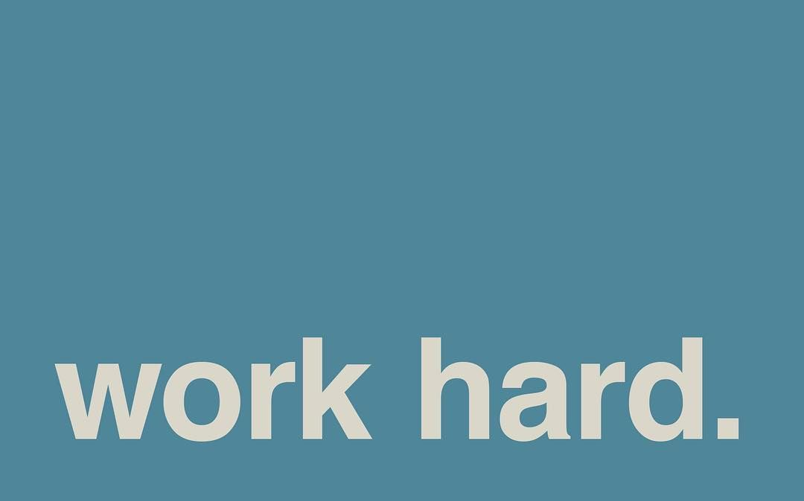

# workers
In a mission to hire at least 500,000 workers around the world. <br />
`If you are grateful, thankful, showing an appreciation for something you received. I will surely increase you in greatness, highness, the quality of being high... [14:7]` | curently on 19 April 2020, at least over 600,650,000 humans on planet Earth still live in extreme poverty, lack of the means necessary to meet basic personal needs, such as food, clothing and shelter, not even a single human able to escape extreme poverty in a second.

 

## Table of Contents
1. [Mission introduction.](#mission)
2. [Goals.](#goals)
3. [Official references websites.](#references)
4. [Benchmarks.](#benchmarks)
5. [Worker flow.](#workerflow)
6. [Time management.](#timemanagement)
7. [Command & Control and CIA triad.](#command)
8. [Sense of belonging & belongingness & belonging.](#belonging)
9. [Unit of measurement.](#unit)
10. [Commodity.](#commodity)
11. [GitHub notes.](#github)
12. [GitHub repository calculation.](#calculation)

<a name="mission"></a>
## 1. Mission introduction.

Every mission accomplished means every single worker in the mission will receive at least 1 kupang, when the workers managed to ally with other workers, at least 10 workers in a group, and every single worker having at least 10 kupang in their possession then the company will arrange accounting and finance class for every 3 months for at least 3 hours with every single worker will have their specialized comfortable seat or chair and a book to keep track of their financial record and performance for each mission within the company. `Practice makes perfect`, after they attended at least 10 accounting, finance and club management classes arranged by the company, completed all the practices given by the company instructor, then the company will arrange the next stage and level of the financial knowledge for the workers, at least 5 hours bank, investment and asset management class, with their own specialized comfortable seat or chair and a meeting table with a dimension of 200 inches of length x 70 inches of width x 35 inches of height, to ease them writing better table of contents for business proposals, structuring the business law and regulations, presenting their ideas to the group of workers in their alliance. On the next stage, the group of 10 workers will form another alliance with another 5 groups (each group consisting of 10 workers), the total group of worker alliances is 6 to make the counting process easier, manually by using both normal human hands and fingers, by implementing the base 60 system, and also to manage the time as efficient as possible, aiming for better accuracy of directions rather just using left right front back commands, to make sure everyone is well-aligned with at least the person sitting next to him or her, for the purpose to do initial practice on how the financial, banks and investment firms works, to get a clearer bigger picture, crystal clear vision on what they want to achieve in pursue of their own financial freedom in their life before the next board meeting, where everyone in the meeting in the latter stage will hold the director title. A proper building, equipment, logistic operations for workers financial operations based on their own proposals on those meetings can only be guaranteed when the workers, the group of 10 people agreed, made an official statement and agreement to join and become the Legion, a group of at least 5,000 men and women for the company, every 5 years, there will be a major conference to reach the next stage after they agreed to join and become a Legion, to become a government, a workforce, a group of at least 500,000 workers to ease all the financial path for all the workers in the company. A month for the workers that not reached the level of a Legion, still in the training period will be fixed to 30 days a month, every mission will not exceed 60 days to ease the calculation process before the 3 hours accounting and finance class on the third month for better preparation, fully focus to the lesson and instructions from the company instructors. All the financial calculation for the fresh recruited workers will try to use the easiest mathematical method by learning on how to count by using their own hands, for example if using base 10 system, they may need to write down all the numbers when they try to do the fraction operation of 1/3 = 0.333333, but when they are using base 12 system, 1/3 in base 10 system will become 4/10 = 0.4 in base 12, the fraction operations in base 10 system is much easier in base 12 system, historically weight and measure is based on base 12 system, 1 foot contains 12 inches, for the base 60 system, the digit location in base 60 system can hold more value than using base 10 system, for example the 4 digit number 1234 in base 60 system is equivalent to 223,384 in base 10 system, by the end of all the 10 accounting, finance and club management classes arranged by the company, the company workers will have good knowledge and better understanding why the clock is based on base 12 system; 12 hours clock and base 60 system; 60 minutes, 60 seconds, why there are 24 hours in a day, why a complete full circle is 360 degree; from class to class they will have some basic understanding on why `time is money`; and to properly observe the changes they can see clearly high above the sky; the sun and the moon, and some basic understanding of the importance of the stars they see on the sky when they are fully ready to explore more deep about the world of mathematics, computations and calculations. By knowing the basic principle in base 12 system, base 60 system, knowing that the full circle is 360 degree, knowing how to read properly their surroundings especially the changes of the sun and the moon on the sky, knowing better about themself, how to use the proportion of their own perfect human body for mathematical measurement, the digit, for example, to place a value in positional numeral systems is originally based on the breadth of a human finger. It was a fundamental unit of length in the Ancient Egyptian, Mesopotamian, Hebrew, Ancient Greek and Roman systems of measurement. In astronomy, a digit is using the base 12 system where a digit is 1/12 of the diameter of the sun or the moon. When the workers joined and became the Legion, they will be registered into more advance mathematical classes, begin to learn the basics of trigonometry in the school of engineering that will be built by the company for the workers, using triangle rules to measure properly every single thing they see, the height, width, distance, depth of everything they can see and observe with their own bare naked eyes, with greater accuracy, precision and stability, to have a peace of mind in their calculations, computations, from time to time, the company workers will eventually know why the ancient human civilization like in Ancient Egypt built a lot of very huge and gigantic pyramid with a shape of triangle, a lot of very tall obelisk structures, with a very high precision of calculations, how the Romans managed to get the breads, transport the water, properly engineered their logistics operations, basic resources in its own empire, how they made all the basic food and water supply need for human being always enough for all its civilian in its own empire, with the long term aim for the workers recruited to become a well respected, well functioning government workers, leaders and doers with a good basic, well-rounded governance knowledge, proper mathematics, engineering knowledge gained from the school of engineering setup by the company; continuously testing all the truth of the knowledge gained from all the classes arranged by the company to know better about their self, the director of their own self, as `knowing yourself is the beginning of all wisdom`.

The reason why kupang is selected as the currency for freshly recruited company workers because it is easier to explain on what is the definition of money, the kupang name itself that holds the meaning, the origin and the history of money in human civilization, and also to let as many people involved in the activities, as anything that related to the educational stuff, classroom activities are not profit-based activities in the entry-level but is a very important, critical aspect in developing well educated, knowledgeable, well-rounded workers for the company to accomplish properly any mission in any situation given to them in the future, `education is the passport to the future, for tomorrow belongs to those who prepare for it today`. Alliances will take you further, from the origin of the coin by Alexander The Great who made massive alliances in Akkad, the Arab nations in this world who holds the highest rank, #1, #2, #3, #4 highest value in currencies recognized as legal tender in United Nations (UN), rank as #1, #2, #3, #4, made the Akkad or Akad name as great meaning in their life, عقد, when they made alliances or pacts with other humans on planet Earth. The allied forces who won World War II made the English language as the largest language by the number of speakers, today's major language of trade and industry. If only one man or woman do the job, the work, he or she may gather up to 10 kupang, but with a good mathematical understanding on how the finance system works, how the House of Money or House of Wealth, commonly known as Baitulmal, بيت المال, works, how strategic alliance or strategic partnership works, how to properly manage their current and future assets, how to make good judgment, calculations in very complex logistic operations, how to become a good director who knows how to do proper commands to other people under their care, it is possible for 10 kupang in their current possession when they first attended the accounting, finance and club management can become 1,000,000,000,000,000,000,000,000,000,000,000,000,000,000,000,000,000,000,000,000,000,000,000,000,000,000,000,000,000,000,000,000,000,000,000,000,000,000,000,000,000,000,000,000,000,000,000,000,000,000,000,000,000,000,000,000,000,000,000,000,000,000,000,000,000,000,000,000,000,000,000,000,000,000,000,000,000,000,000,000,000,000,000,000,000,000,000,000,000,000,000,000,000,000,000,000,000,000,000,000,000,000,000,000,000,000,000,000,000,000,000,000,000,000,000,000,000,000,000,000,000,000,000,000,000,000,000,000,000,000,000,000,000,000,000,000,000,000,000,000,000,000,000,000,000,000,000,000,000,000,000,000,000,000,000,000,000,000,000,000,000,000,000,000,000,000,000,000,000,000,000,000,000,000,000,000,000,000,000,000,000,000,000,000,000,000,000,000,000,000,000,000,000,000,000,000,000,000,000,000,000,000,000,000,000,000,000,000,000,000,000,000,000,000,000,000,000,000,000,000,000,000,000,000,000,000,000,000,000,000,000,000,000,000,000,000,000,000,000,000,000,000,000,000,000,000,000,000,000,000,000,000,000,000,000,000,000,000,000,000,000,000,000,000,000,000,000,000,000,000,000,000,000,000,000,000,000,000,000,000,000,000,000,000,000,000,000,000,000,000,000,000,000,000,000,000,000,000,000,000,000,000,000,000,000,000,000,000,000,000,000,000,000,000,000,000,000,000,000,000,000,000,000,000,000,000,000,000,000,000,000,000,000,000,000,000,000,000,000,000,000,000,000,000,000,000,000,000,000,000,000,000,000,000,000,000,000,000,000,000,000,000,000,000,000,000,000,000,000,000,000,000,000,000,000,000,000,000,000,000,000,000,000,000,000,000,000,000,000,000,000,000,000,000,000,000,000,000,000,000,000,000,000,000,000,000,000,000,000,000,000,000,000,000,000,000,000,000,000,000,000,000,000,000,000,000,000,000,000,000,000,000,000,000,000,000,000,000,000,000,000,000,000,000,000,000,000,000,000,000,000,000,000,000,000,000,000,000,000,000,000,000,000,000,000,000,000,000,000,000,000,000,000,000,000,000,000,000,000,000,000,000,000,000,000,000,000,000,000,000,000,000,000,000,000,000,000,000,000,000,000,000,000,000,000,000,000,000,000,000,000,000,000,000,000,000,000,000,000,000,000,000,000,000,000,000,000,000,000,000,000,000,000,000,000,000,000,000,000,000,000,000,000,000,000,000,000,000,000,000,000,000,000,000,000,000,000,000,000,000,000,000,000,000,000,000,000,000,000,000,000,000,000,000,000,000,000,000,000,000,000,000,000,000,000,000,000,000,000,000,000,000,000,000,000,000,000,000,000,000,000,000,000,000,000,000,000,000,000,000,000,000,000,000,000,000,000,000,000,000,000,000,000,000,000,000,000,000,000,000,000,000,000,000,000,000,000,000,000,000,000,000,000,000,000,000,000,000,000,000,000,000,000,000,000,000,000,000,000,000,000,000,000,000,000,000,000,000,000,000,000,000,000,000,000,000,000,000,000,000,000,000,000,000,000,000,000,000,000,000,000,000,000,000,000,000,000,000,000,000,000,000,000,000,000,000,000,000,000,000,000,000,000,000,000,000,000,000,000,000,000,000,000,000,000,000,000,000,000,000,000,000,000,000,000,000,000,000,000,000,000,000,000,000,000,000,000,000,000,000,000,000,000,000,000,000,000,000,000,000,000,000,000,000,000,000,000,000,000,000,000,000,000,000,000,000,000,000,000,000,000,000,000,000,000,000,000,000,000,000,000,000,000,000,000,000,000,000,000,000,000,000,000,000,000,000,000,000,000,000,000,000,000,000,000,000,000,000,000,000,000,000,000,000,000,000,000,000,000,000,000,000,000,000,000,000,000,000,000,000,000,000,000,000,000,000,000,000,000,000,000,000,000,000,000,000,000,000,000,000,000,000,000,000,000,000,000,000,000,000,000,000,000,000,000,000,000,000,000,000,000,000,000,000,000,000,000,000,000,000,000,000,000,000,000,000,000,000,000,000,000,000,000,000,000,000,000,000,000,000,000,000,000,000,000,000,000,000,000,000,000,000,000,000,000,000,000,000,000,000,000,000,000,000,000,000,000,000,000,000,000,000,000,000,000,000,000,000,000,000,000,000,000,000,000,000,000,000,000,000,000,000,000,000,000,000,000,000,000,000,000,000,000,000,000,000,000,000,000,000,000,000,000,000,000,000,000,000,000,000,000,000,000,000,000,000,000,000,000,000,000,000,000,000,000,000,000,000,000,000,000,000,000,000,000,000,000,000,000,000,000,000,000,000,000,000,000,000,000,000,000,000,000,000,000,000,000,000,000,000,000,000,000,000,000,000,000,000,000,000,000,000,000,000,000,000,000,000,000,000,000,000,000,000,000,000,000,000,000,000,000,000,000,000,000,000,000,000,000,000,000,000,000,000,000,000,000,000,000,000,000,000,000,000,000,000,000,000,000,000,000,000,000,000,000,000,000,000,000,000,000,000,000,000,000,000,000,000,000,000,000,000,000,000,000,000,000,000,000,000,000,000,000,000,000,000,000,000,000,000,000,000,000,000,000,000,000,000,000,000,000,000,000,000,000,000,000,000,000,000,000,000,000,000,000,000,000,000,000,000,000,000,000,000,000,000,000,000,000,000,000,000,000,000,000,000,000,000,000,000,000,000,000,000,000,000,000,000,000,000,000,000,000,000,000,000,000,000,000,000,000,000,000,000,000,000,000,000,000,000,000,000,000,000,000,000,000,000,000,000,000,000,000,000,000,000,000,000,000,000,000,000,000,000,000,000,000,000,000,000,000,000,000,000,000,000,000,000,000,000,000,000,000,000,000,000,000,000,000,000,000,000,000,000,000,000,000,000,000,000,000,000,000,000,000,000,000,000,000,000,000,000,000,000,000,000,000,000,000,000,000,000,000,000,000,000,000,000,000,000,000,000,000,000,000,000,000,000,000,000,000,000,000,000,000,000,000,000,000,000,000,000,000,000,000,000,000,000,000,000,000,000,000,000,000,000,000,000,000,000,000,000,000,000,000,000,000,000,000,000,000,000,000,000,000,000,000,000,000,000,000,000,000,000,000,000,000,000,000,000,000,000,000,000,000,000,000,000,000,000,000,000,000,000,000,000,000,000,000,000,000,000,000,000,000,000,000,000,000,000,000,000,000,000,000,000,000,000,000,000,000,000,000,000,000,000,000,000,000,000,000,000,000,000,000,000,000,000,000,000,000,000,000,000,000,000,000,000,000,000,000,000,000,000,000,000,000,000,000,000,000,000,000,000,000,000,000,000,000,000,000,000,000,000,000,000,000,000,000,000,000,000,000,000,000,000,000,000,000,000,000,000,000,000,000,000,000,000,000,000,000,000,000,000,000,000,000,000,000,000,000,000,000,000,000,000,000,000,000,000,000,000,000,000,000,000,000,000,000,000,000,000,000,000,000,000,000,000,000,000,000,000,000,000,000,000,000,000,000,000,000,000,000,000,000,000,000,000,000,000,000,000,000,000,000,000,000,000,000,000,000,000,000,000,000,000,000,000,000,000,000,000,000,000,000,000,000,000,000,000,000,000,000,000,000,000,000,000,000,000,000,000,000,000,000,000,000,000,000,000,000,000,000,000,000,000,000,000,000,000,000,000,000,000,000,000,000,000,000,000,000,000,000,000,000,000,000,000,000,000,000,000,000,000,000,000,000,000,000,000,000,000,000,000,000,000,000,000,000,000,000,000,000,000,000,000,000,000,000,000,000,000,000,000,000,000,000,000,000,000,000,000,000,000,000,000,000,000,000,000,000,000,000,000,000,000,000,000,000,000,000,000,000,000,000,000,000,000,000,000,000,000,000,000,000,000,000,000,000,000,000,000,000,000,000,000,000,000,000,000,000,000,000,000,000,000,000,000,000,000,000,000,000,000,000,000,000,000,000,000,000,000,000,000,000,000,000,000,000,000,000,000,000,000,000,000,000,000,000,000,000,000,000,000,000,000,000,000,000,000,000,000,000,000,000,000,000,000,000,000,000,000,000,000,000,000,000,000,000,000,000,000,000,000,000,000,000,000,000,000,000,000,000,000,000,000,000,000,000,000,000,000,000,000,000,000,000,000,000,000,000,000,000,000,000,000,000,000,000,000,000,000,000,000,000,000,000,000,000,000,000,000,000,000,000,000,000,000,000,000,000,000,000,000,000,000,000,000,000,000,000,000,000,000,000,000,000,000,000,000,000,000,000,000,000,000,000,000,000,000,000,000,000,000,000,000,000,000,000,000,000,000,000,000,000,000,000,000,000,000,000,000,000,000,000,000,000,000,000,000,000,000,000,000,000,000,000,000,000,000,000,000,000,000,000,000,000,000,000,000,000,000,000,000,000,000,000,000,000,000,000,000,000,000,000,000,000,000,000,000,000,000,000,000,000,000,000,000,000,000,000,000,000,000,000,000,000,000,000,000,000,000,000,000,000,000,000,000,000,000,000,000,000,000,000,000,000,000,000,000,000,000,000,000,000,000,000,000,000,000,000,000,000,000,000,000,000,000,000,000,000,000,000,000,000,000,000,000,000,000,000,000,000,000,000,000,000,000,000,000,000,000,000,000,000,000,000,000,000,000,000,000,000,000,000,000,000,000,000,000,000,000,000,000,000,000,000,000,000,000,000,000,000,000,000,000,000,000,000,000,000,000,000,000,000,000,000,000,000,000,000,000,000,000,000,000,000,000,000,000,000,000,000,000,000,000,000,000,000,000,000,000,000,000,000,000,000,000,000,000,000,000,000,000,000,000,000,000,000,000,000,000,000,000,000,000,000,000,000,000,000,000,000,000,000,000,000,000,000,000,000,000,000,000,000,000,000,000,000,000,000,000,000,000,000,000,000,000,000,000,000,000,000,000,000,000,000,000,000,000,000,000,000,000,000,000,000,000,000,000,000,000,000,000,000,000,000,000,000,000,000,000,000,000,000,000,000,000,000,000,000,000,000,000,000,000,000,000,000,000,000,000,000,000,000,000,000,000,000,000,000,000,000,000,000,000,000,000,000,000,000,000,000,000,000,000,000,000,000,000,000,000,000,000,000,000,000,000,000,000,000,000,000,000,000,000,000,000,000,000,000,000,000,000,000,000,000,000,000,000,000,000,000,000,000,000,000,000,000,000,000,000,000,000,000,000,000,000,000,000,000,000,000,000,000,000,000,000,000,000,000,000,000,000,000,000,000,000,000,000,000,000,000,000,000,000,000,000,000,000,000,000,000,000,000,000,000,000,000,000,000,000,000,000,000,000,000,000,000,000,000,000,000,000,000,000,000,000,000,000,000,000,000,000,000,000,000,000,000,000,000,000,000,000,000,000,000,000,000,000,000,000,000,000,000,000,000,000,000,000,000,000,000,000,000,000,000,000,000,000,000,000,000,000,000,000,000,000,000,000,000,000,000,000,000,000,000,000,000,000,000,000,000,000,000,000,000,000,000,000,000,000,000,000,000,000,000,000,000,000,000,000,000,000,000,000,000,000,000,000,000,000,000,000,000,000,000,000,000,000,000,000,000,000,000,000,000,000,000,000,000,000,000,000,000,000,000,000,000,000,000,000,000,000,000,000,000,000,000,000,000,000,000,000,000,000,000,000,000,000,000,000,000,000,000,000,000,000,000,000,000,000,000,000,000,000,000,000,000,000,000,000,000,000,000,000,000,000,000,000,000,000,000,000,000,000,000,000,000,000,000,000,000,000,000,000,000,000,000,000,000,000,000,000,000,000,000,000,000,000,000,000,000,000,000,000,000,000,000,000,000,000,000,000,000,000,000,000,000,000,000,000,000,000,000,000,000,000,000,000,000,000,000,000,000,000,000,000,000,000,000,000,000,000,000,000,000,000,000,000,000,000,000,000,000,000,000,000,000,000,000,000,000,000,000,000,000,000,000,000,000,000,000,000,000,000,000,000,000,000,000,000,000,000,000,000,000,000,000,000,000,000,000,000,000,000,000,000,000,000,000,000,000,000,000,000,000,000,000,000,000,000,000,000,000,000,000,000,000,000,000,000,000,000,000,000,000,000,000,000,000,000,000,000,000,000,000,000,000,000,000,000,000,000,000,000,000,000,000,000,000,000,000,000,000,000,000,000,000,000,000,000,000,000,000,000,000,000,000,000,000,000,000,000,000,000,000,000,000,000,000,000,000,000,000,000,000,000,000,000,000,000,000,000,000,000,000,000,000,000,000,000,000,000,000,000,000,000,000,000,000,000,000,000,000,000,000,000,000,000,000,000,000,000,000,000,000,000,000,000,000,000,000,000,000,000,000,000,000,000,000,000,000,000,000,000,000,000,000,000,000,000,000,000,000,000,000,000,000,000,000,000,000,000,000,000,000,000,000,000,000,000,000,000,000,000,000,000,000,000,000,000,000,000,000,000,000,000,000,000,000,000,000,000,000,000,000,000,000,000,000,000,000,000,000,000,000,000,000,000,000,000,000,000,000,000,000,000,000,000,000,000,000,000,000,000,000,000,000,000,000,000,000,000,000,000,000,000,000,000,000,000,000,000,000,000,000,000,000,000,000,000,000,000,000,000,000,000,000,000,000,000,000,000,000,000,000,000,000,000,000,000,000,000,000,000,000,000,000,000,000,000,000,000,000,000,000,000,000,000,000,000,000,000,000,000,000,000,000,000,000,000,000,000,000,000,000,000,000,000,000,000,000,000,000,000,000,000,000,000,000 kupang; `bersekutu bertambah mutu`.

Fresh workers training, mentoring, advising ratio : **[1:1]** -> **[1:10]** -> **[1:60]** <br />
Fresh workers training, mentoring, advising duration : **[2 months]** -> **[30 months]** -> **[2 months]** | about 3 years <br />
Training objectives : financial freedom for each individual workers, understand logistics, fit properly with company culture <br />

<a name="goals"></a>
## 2. Goals.

EVERY SINGLE DAY
---
Just to make sure in every 10 hours, they will get at least
1) FREE Accommodation ((length : 250 inches) x (width : 250 inches) x (height : 250 inches), per capita)
2) FREE Bath (150 litres, per capita)
3) FREE Drink (2.5 litres, per capita)
4) FREE Bread (1/4 of a single dinner plate, per capita) 
5) FREE Meat or Fish: depends on available livestock || Vegetables for Vegetarians (1/4 of a single dinner plate, per capita) 
6) FREE Fruits (1/4 of a single dinner plate, per capita) 
7) FREE Rice || Buckwheat or Millet for workers that need to chase their time (1/4 of a single dinner plate, per capita)
8) FREE Toilet Paper (1 roll: 4.5 inches long x 4.5 inches wide, at least 200 sheets per roll, per capita)
9) FREE Soap (1 US fluid ounce or 29.5735 millilitres, per capita)
10) FREE Toothpaste (2 gram, per capita)
11) FREE Land Transportation (for those who needs to march and hit ground more than 1,000 paces, per capita)
12) FREE Land, Sea, Air Transportation (for those who needs to move more than 200,000 paces, per capita)
13) 1-hour rest after 10 hours work

For every worker who needs to move more than 1 miles, at least more than 5,000 steps, more than 2km or equivalent to 2,000 metres, then in each of their 5,000 steps in their work for the company, they will be given at least 1 pound or equivalent to 0.453592 kilograms or equivalent to 453.5920000001679 gram of sea salt to preserve their food and to fight unwanted bacterial growth, restore hydration, and to absorb dirt, grime, and toxins, cleanses the worker's skin's pores deeply, helps restore the protective barrier in skin and helps it hold hydration, help remove stains and brighten teeth, disinfectant to kill the bacteria that can cause bad breath and gingivitis, softens cuticles and skin and strengthens nail, so the workers can always stay healthy while working for the company. There are at least 12 types of salt used in culinary around the planet Earth, that is safe for human consumption.

* a single dinner plate is at least 13 inches in size <br />
* since animals, livestock like cattle, cow, that needs years to multiply, goat, sheep, that needs half of a single year to multiply, it needs very good management, give it some time to multiply, among the solution is the bird type of meat like chicken also only take a couple of months to multiply, and the water-based animals like fish that usually take weeks to multiply <br />
* 1 cup of wild rice need to cook between 45 to 55 minutes before serving it to workers, some workers may need to chase their time for their other tasks or jobs they need to do in their life, therefore should give them other cereal option that can help with the workers time management <br />
* all foods and drinks must be fresh, properly cooked to prevent any sickness of the workers, to maximize the number of nutrient intakes, the maximum is 24 hours from the kitchen finished product preparation to the table of workers, specialize the route for dining preparation so everything can move smoothly, eliminating any waste of time during the food and drinks prepared for the workers
* drink is at least properly boiled raw water, properly treated hot tea, properly treated hot chocolate
* bread is at least a loaf of baguette, a loaf of brioche, a loaf of fougasse, a loaf of michetta
* fruit is at least one cavendish banana, one watermelon, one pineapple, one papaya, one guava

Every night, before 11 pm, do a daily check-up on the kitchens and bathrooms, make sure everything is working fine, in good order, in a good arrangement, clean and tidy, without any mess. If everything is strange or broken, take some simple notes of it, try to fix it within 24 hours, the clean working environment creates a clean mind for everyone, easy to reach meaning easier access for everyone.

Spend at most 1 hours, every 12 hours to communicate with the workers, at least for 30 minutes to generate better train of thought, be discipline, do not exceed 1 hour conversation with the workers every 8 hours to avoid biased opinions, try to understand more about workers behaviours. Design at least a solution, better workflow for the workers within 24 hours after each conversation. Eliminate anything that does not add value to the workers, work systematically and continuously to create more value for the workers. Define, visualize, optimize, and manage the entire organizational value stream as one value-generating system. Make decisions that optimize the entire organization’s ability to deliver value to the workers, not just one team or department.


EVERY 2 DAYS
---
Make sure everyone can get at least 8 hours sleep and rest, do a rotation of workers if any of them is not enough of rest. Allocate enough resources for at least 5 substitute workers for one week of work, in any case of emergencies occurs.

Make sure to count everything is enough for every worker, make use of the unit of measurement and commodity used for the mission, always make calculation on the differences of the supply between the current day and previous day, take notes of anything happening in the supply chain.

Spend at most 1 hour of reading some books or reading materials that are related to workers productivity and engineering-related disciplines, try to ask at most 1 question, when finished reading the books in 1 hour, to sharpen my mind, try to solve it within 24 hours, try to discipline myself do not exceed more than 1 hour every 2 days reading the workers productivity and engineering-related knowledge books because time is limited, prioritize the daily, weekly planned works first, finish all the main tasks first, try to read some books or reading materials that are related to workers productivity and engineering-related disciplines in more than 30 minutes to develop a proper chain of thought, the connections that link the various parts of an event or argument together. Duration of reading any books that are related to workers productivity and engineering-related disciplines is between 30 minutes to 60 minutes (1 hour), the main objective of reading the books is always on how to do less while achieving more, how to make life easier for everyone around me and also to myself.

Always remind my self that yesterday is 24 hours, tomorrow must plan at most for 24 hours, today spend 1 hour properly, as every hour in every workers lifetime in the company is so valuable, time is limited, 1 full day, either yesterday or today or tomorrow only consist of at most 24 hours.

EVERY 5 DAYS
---
The workers that already exceed 100 working hours every 5 days, automatically will be given at least 24 hours uninterrupted rest. 

Human workers that did not have enough sleep, enough rest are very risky for the company because they will have :
* anxiety
* unstable mood
* drowsiness
* forgetfulness
* difficulty concentrating
* difficulty staying alert
* cognitive impairments
* decreased performance at work or school
* increased risk of illness or injury

EVERY 7 DAYS
---
At least 24 hours enough sleep and rest every single week, continuously without any interruption or any disturbance, having very strong mental health, in a very good state of mind, at every beginning of the month in the Gregorian calendar.

At least 5 hours break for Friday prayer, starting from 12 pm to 5 pm.

1) FREE Salt (1 US tablespoon equivalent to 14.7868 millilitres, per capita)
2) FREE Citrus (1 citrus of at least  3 centimetres in diameter, per capita)

* There are at least 110 species of citrus on planet Earth to choose from for the workers, to make sure they are always in a good health every weekend to do their daily works. Every week make sure to check their teeth and tongue, give them at least 1 citrus if found anything strange on their teeth and tongue, and give them rest of at least 24 hours, 1 full day off, to give them enough time for health recovery.

Make sure to count everything is enough for every worker, make use of the unit of measurement and commodity used for the mission, always make calculation on the differences of the supply, take notes of anything happening in the supply chain. Plot a simple weekly graph and do simple statistics about it to read what is happening to it.

EVERY FULL MOON
---
Every time I see a full moon appears on the sky, every single worker must receive at least 1 gantang Negeri of rice, which equals to 2.751 kg of rice following the rules in my mother tongue language "ada padi semua kerja jadi, ada beras semua kerja deras", and every leap year on Gregorian Calendar, on every 29 February, which happens only every 4 years on this earth, every century of workers which equals to 10 contubernium with a total of 80 men commanded by a centurion, a total of at least 81 workers, must receive at least a 4-year-old healthy cow following the standard of Etruscan Emilia-Romagna, which means every cow must be a weight of at least 1,000 kg for each century of workers.

Make sure to count everything is enough for every worker, make use of the unit of measurement and commodity used for the mission, always make calculation on the differences of the supply, take notes of anything happening in the supply chain. Gather all the weekly graph, weekly statistics and make a comparison to better understand what is happening with the workers. Call for a general meeting with the workers who already reached the level of the centurion to reorganize the strategy, tactic and plan for all the workers under their command.

EVERY 3 MONTHS
---
Try to gather every kind of intelligence from the chefs and the working condition of the kitchen, allocate some portion of company profit to upgrade the kitchen equipment, to send the chef to various kind of countries and cultures in the universe, at least 1 other country or different kind of culture, so they can upgrade their skill and be more creative with their style of cooking, also prepare a special schedule for them, at least one week or more than 150 hours in every 3 months for them to spend more time with various kind of workers in the company, to better understand behaviours of the workers in the company, to always fit with the interest of the workers in the company, to develop more happiness between the workers, chefs, their food and their drinks. 

Chef is the star of the company, so it can attract more workers into the company. The chef cook is the person, who organizes all the work in the company kitchen, and he or she is also the link between the owner of the company and the rest of the workers. A chef cook can be compared to the orchestra conductor, and this means that the success of the company is highly depends on him or her. 

One of the most important qualities a good chef has is building intelligence, that requires cleverness in math. Smart chefs know how to save ingredients and to make most profit of them. They can quickly calculate food costs even without given the information needed, because they are able to control the size of the portion, which leads to accurate menu engineering. For instance, chefs can use equations in order to estimate how many crèmes brûlées can be made with 27 egg yolks. Even when chefs decide to think outside the box and do not precisely stick to the original recipe, math is useful to ensure the right proportions are maintained. Math can be advantageous when converting measurements (ounces to grams, cups to milliliters etc.) In such way, the ingredients are not wasted and the money is saved, can be used for during the emergency situation.

Chefs also have the responsibilities of planning menus, help and supervise the preparation of dishes as well as developing recipes. The chefs order supplies and receive them in the kitchen. It is also a duty of the chefs to maintain cleanliness in the kitchen.

EVERY 12 MONTHS
---
Invent a solution on how to make all the food and drinks can last for at least another 12 months, take notes of the expiry date, make sure all the food and drink supply is always enough for all workers in the next full year, 12 months.

EVERY 13 MONTHS
---
At least 5 days break for Aidil-fitri (2 last days in Ramadhan and 3 first days in Shawwal, from 29 Ramadhan to 3 Shawwal following at-taqwīm al-hijrī calendar), at least 7 days break for Aidil-Adha (from 8 Zulhijjah to 14 Zulhijjah following at-taqwīm al-hijrī calendar), 20 days break from 23 December to 11 January every 13 months. 25 days break for yearly travel and pilgrimage of Israk Mi'raj, to travel with the workers and family members to Masjidil Haram in Mecca and Masjidil Aqsa in Palestine, travel by land, air and sea, mostly by walking on land when already arrived on Masjidil Haram in Mecca and Masjidil Aqsa in Palestine land area, starting from 22 Rejab to 17 Sha'ban following at-taqwīm al-hijrī calendar, must arrive on Masjidil Haram in Mecca before Subuh, before 5 am on 25 Rejab, must arrive on Masjidil Aqsa before the Maghrib, before 6 pm on 27 Rejab, must arrive on Masjidil Haram in Mecca before Subuh, before 5 am on 15 Sha'ban. Annual break for every 13 months must be at least 37 days or equivalent to 888 hours, or equivalent to 53,280 minutes, or equivalent to 53,280 minutes, ‪or equivalent to 3,196,800‬ seconds, or equivalent to ‪3,196,800,000‬ milliseconds, or equivalent to ‭‪3,196,800,000,000‬‬ microseconds, combining the breaks in the months of Ramadhan, Shawwal, Zulhijjah, Rejab and Sha'ban following at-taqwīm al-hijrī calendar.

*** Every worker that reached the level of the **Centurion**, meaning a commander of 100 men or women, a leader of a **Tribe** will be given at least 25,000 kupang, to ease their work as the leader of his or her company or tribe.

*** Every worker that reached the level of the **Centurion**, successfully managed their own 100 men or women, ask him or her, if he or she is interested in becoming a **Legion** for at least 25 years of service, commanding at least 5,000 men or women under him or her, grant him or her a title of **Lord** if he or she successfully managed 5,000 men or women under him or her, become the main **Legend** of his or her people, his or her tribe, the real master of food and drink supply chain and its flow for his or her people, his or her tribe, then at the end of his or her 25 years of service for the company, that worker will own some piece of land and building under his or her complete control and authority with a special ceremony by the company will be held for him or her, and a special tribute and respect, from at least, all of his or her minimum 5,000 men or women, under his or her command, supervision, within his or her 25 years of service to the company. 

EVERY 2 YEARS
---
Host company grand presentation, focusing on the complex logistics operation, solving other major issues like "Peter Principle"; an observation that the tendency in most organizational hierarchies, such as that of a corporation, is for every employee to rise in the hierarchy through promotion until they reach a level of respective incompetence. Revise the skill training for workers receiving a promotion, and to ensure the training is appropriate for the position to which they have been promoted.

EVERY 3 YEARS
---
Develop internal technology roadmap software to make knowledge transfer easier within the company, gathering expert insight to display, document, making a diagram that illustrates the technology and tools used by the company. Technology roadmaps are created to help business leaders plan and strategize which, when, and why certain technologies will be onboarded while avoiding expensive mistakes and even planning for technologies becoming obsolete.

An effective technology roadmap should also outline a strategy to reach short- and long-term digital transformation goals, if applicable. A technology roadmap illustrates the technology presently available and emphasizes scheduled improvements. A technology roadmap should also consider which technologies will become obsolete or are scheduled for the end of life. For example, a work management software system will show when the previous system will sunset and when the new one will be implemented.

When developing the internal technology roadmap, be clear, realistic, easy to share among all the members in the company. All the internal software used within the company must have a lifespan of continuous support at least for 3 continuous years.

EVERY 5 YEARS
---
Establish at least one school of engineering for the workers who want to become a **Legion** of the company. Fully open for 24-hours per day but after every 7 hours, give 1 hour time for the cleaning and re-arranging service to take place, so everybody can do their works with a clear mind and less interruption from others. Focusing on civil engineering discipline with government administration studies.

The school must consist at least 5,000 students with their working area of at least 2 square meters, continuous flow of fresh air so if any pandemic occurs, if there is still a need to hold the class by the teachers, at least already tried to minimize the risk when everyone is in the school, at least 50 teachers with their working area following the Australian Army Slow Time that is 70 paces per minute with a 75cm pace, of at least 10,000 steps per day. To get continuous fresh air, the school will be built in the middle of a newly explored jungle, newly explored virgin territory, between at least 4 hills, where the fresh air from those hills where in the middle of it will be built the school of engineering by the company, will first be tested using according to the prophet Ibrahim / Abraham / Avraham / Abram divine method mentioned in `2:260`, each of the hills is at least 1,000 feet or equivalent to 304.8 meters above sea level. Before building the school, send the workers that will become the mason, builder of the school to Iraq, Turkey, Iran, and Kuwait, hire as many people from those countries to become the workers for the company, study, analyze all the hills and mountains, and all properties and attributes of the hills and mountains from those countries especially in Ancient Civilization of Mesopotamia area, the land in the middle, between rivers, the area of at least 15,000-square-kilometre, to properly apply the prophet Ibrahim / Abraham / Avraham / Abram divine method mentioned in `2:260` to build the school of engineering for the company. If can't find any 4 natural mountains to build the school in the middle of it within 5 years then try to build man-made 4 towers on each side of the area selected, with the height of at least 475,048.768 metres, that will have a height of at least as same as Q1 Tower, Queensland Number One in Australia, that is 322.5-metre or equivalent to 1,058 feet in height to test the air quality of the surrounding area, for at least 1 full month, at least 30 days, before deciding to build the main school building in the middle of the 4 towers, to minimize any health risk factors for the people inside the school area. 

Particulate pollution is observed around the globe in varying sizes and compositions and is the focus of many epidemiological studies. Particulate matter (PM) is generally classified into two main size categories: PM10 and PM2.5. PM10, also known as coarse particulate matter, consists of particles 10 micrometers (μm) and smaller, while PM2.5, also called fine particulate matter, consists of particles 2.5 μm and smaller. PM is a common proxy indicator for air pollution. It affects more people than any other pollutant. While particles with a diameter of 10 microns or less, (≤ PM10) can penetrate and lodge deep inside the lungs, the even more health-damaging particles are those with a diameter of 2.5 microns or less, (≤ PM2.5). PM2.5 can penetrate the lung barrier and enter the blood system. Chronic exposure to particles contributes to the risk of developing cardiovascular and respiratory diseases, as well as of lung cancer. Particles 2.5 μm or smaller in size are especially notable as they can be inhaled into the lower respiratory system, and with enough exposure, absorbed into the bloodstream. The air quality measurement for every 4 hills or 4 towers on each side of the school building for PM2.5 must be below than 25 μg/m3 within 24-hour mean, measurement for PM10 must be below than 50 μg/m3 within 24-hour mean, routine air quality measurements typically describe such PM concentrations in terms of micrograms per cubic meter (μg/m3). When sufficiently sensitive measurement tools are available, concentrations of fine particles (PM2.5 or smaller), are also reported.

The school library following the standard of The House of Commons Library of the lower house of the British Parliament, that can consist at least 30,000 books majoring in history, topography, literature, biography and politics, as well as the official papers of the company, consisting 4 large rooms, every 40 feet by 25 feet and some 20 feet high. Fully open for 24-hours per day but after every 7 hours, give 1 hour time for the cleaning and re-arranging service to take place, so everybody can do their works with a clear mind and less interruption from others. Every room will have their clock system, so it if the cleaning process is on the way the students or the teachers can always move into another place, so the library is always functioning, welcoming all the people from all over the world. The cleaning and re-arranging service on the main entrace will also have their own working hour each day, this is to make sure to fit with everybody schedule, and also will have at least 4 main entrance into the library, by whole, it is always working non-stop for 24 hours every single day, it will act as one of the main brain of the company. The library will also have a secret door access to it, to be use by the Centurions, Legions, Governments created by the company if all the main doors is not functioning well.

The company will build a continuously flowing water system, visible and not visible hydraulic water system to be used by the teachers and the students in the school. Water is the source of life and the main motivation for human beings to stay alive. Water is an important strategic source for all countries of the world without exception and is far-reaching and is now a major cause of many conflicts and political conflicts. There are several international conventions on water, such as the United Nations Convention to Combat Desertification, the Marbol Convention for the Prevention of Pollution from Ships and the Ramsar Convention on the Conservation and Sustainable Use of Wetlands. To make sure this as a constant reminder, then the main office of the school will have their own ship above the water so they can see clearly what is always happening to the water system of the school built by the company. 

The school of engineering that will be establish by the company in every 10 years is at least 47,504,876.8 centimetres x 47,504,876.8 centimetres x 300 centimetres, or equivalent to 475,048.768 meter x 475,048.768 meter x 3 meter.

The method that will be used in the project is fully open-source so that anyone in this world can contribute, any donation can be done by donating as small as 1¢ cent or 1p penny coin, so everyone in this world can donate and contribute for the school of engineering project, anyone in this world also can enrol in this class free of any charge, fully sponsored by the company, at least for 7 hours in their lifetime before cleaning and re-arranging service takes place in the school of engineering. Those coming from outside of the company, when they made even a single step into the school, then invite them to be the worker of the company. The hiring process must always go on, hire as many workers as possible into the company.

A teacher to students ratio shall not exceed 1 teacher to every 100 students, 1:100 in a single class, to make sure every teacher in that school has a good healthy mind if there is a needs to exceed that ratio, then need to ask the teacher either they can accept more students into their class or not, so they can do their teaching works with a full heart. The school will always remain as a non-profit organization to make sure the education is always accessible to as many people as possible, any profit gain from selling the teachers own hand-writing will be given back to the teacher wrote that book, 100% ownership of their book writing for the students in the company school.

Any students or teachers that already completed 25,000 hours in the company school, invite them to write at least 25,000 words of a thesis to improve the school system and what their suggestion to improve the company way works. Give them at least any single (1) best product produced by the company as gratitude for writing the thesis after completing a degree, at least 25,000 hours in the school.

Although the school will adopt a full open-source method in their teachings and education, all the offices, libraries, roads, any path in the school, the infrastructures in the school are 100% fully owned by the company, same will happen when the Lords from the company finally formed their own government, all the embassies, the roads, the land, infrastructures inside the foreign embassies in that government will be fully owned by other government within a certain time of period, anything happens inside it can only deal with the Rex, Lord and their main people to maintain proper diplomacy with all other governments, other kings, other ministers around the entire universe. As a constant reminder to everyone in that school, then everything that is owned by the company will have its own mark of words and symbol, logo saying that is fully owned, 100% owned by the company, that is visible to normal human eyes, or for at least 2 metres in distance for a human that has visual acuity of perfect “20/20” vision.

From at least 5 schools of engineering established by the company in 25 years, there must be at least one (1) proper **Lord** will be fully developed, created by the school of engineering set up by the company, to govern and rule any nation in the entire universe. Within 10 schools of engineering established by the company in 50 years, there must be at least one (1) proper **Rex** will be fully developed, created by the school of engineering set up by the company as `education is the passport to the future, for tomorrow belongs to those who prepare for it today`.

EVERY 10 YEARS
--
Devise at least 1 invention that is useful for workers with disabilities. A disability is any condition that makes it more difficult for a person to do certain activities or interact with the world around them. These conditions, or impairments, may be cognitive, developmental, intellectual, mental, physical, sensory, or a combination of multiple factors. Impairments causing disability may be present from birth or occur during a person's lifetime. Hire all people from all background including people with disabilities into the company.

Not everyone in this world was born in 'Perfect 10' condition, the first human achieved the 'Perfect 10' score in gymnastics is a female human being, Věra Čáslavská from Czechoslovakia, today is known as Czech Republic, Slovakia and Ukraine, gained the title 'the love of Tokyo' after winning the overall title and taking gold medals in the balance beam and the vault, in addition to another silver medal in the team event during 1964 Summer Olympics in Tokyo. Currently, a human in Tokyo, Japan, Nakamatsu Yoshirō, also known as Dr. NakaMats  holds the most world record for a number of over 3,200 "inventions" in the world of engineering. If you can't do all the gymnastics 'Perfect 10' moves that you see in your lifetime, then at least try to invent any stuff, any tool, any machine, anything, that is useful for others that are not able to do all kind of 'Perfect 10' moves in Olympic Games, the people with disabilities, try to make other people life easier. Mark Elliot Zuckerberg, the founder of Facebook is one of human being born with disabilities, Mark Elliot Zuckerberg then founded Facebook with the help of his family members especially with his beloved sister, Randi Jayne Zuckerberg that has a unique speciality in marketing and advertising. In late 2004, Mark Elliot Zuckerberg asked his sister, Randi Jayne Zuckerberg to join him at his startup Facebook, which he said was understaffed with people willing to travel and who could explain his vision, then Randi Jayne Zuckerberg becomes the director of market development and spokesperson for Facebook to help his beloved colour-blind brother Mark Elliot Zuckerberg set up his own business and become successful in his life. According to The New Yorker, Mark Zuckerberg is red-green colourblind, which means the colour he can see best is blue. That also happens to be the colour that dominates the Facebook website and mobile app. "Blue is the richest colour for me," Mark Elliot Zuckerberg told the magazine. In a duration of 15 years, this brother and sister co-operation of Zuckerberg family members attracted from 0 to at least 2.3 billion users on planet Earth. Right now, human being on planet Earth, especially in Indonesia and Nigeria, when asked "what is the Internet?", most of them will answer, "Facebook", always believe that helping human born with disabilities will outcome a good result, everybody, everyone is special, born with a reason in their own way.

EVERY 20 YEARS
---
Build at least 1 supercomputer that capable of at least over 1,000,000,000,000,000,000 operations, calculations per second to hire as many workers as possible into the company from all over the universe. A supercomputer is a group of computers that act as one collective machine, and it’s used to process enormous amounts of data.

With that extreme speed comes extreme heat. Supercomputers can consume as much power as a small city. Studies show that data centres in the United States of America consume 2 per cent of the country’s total energy consumption, one of the reasons why United States of America (USA) places their specialized supercomputer project under Federally Funded Research and Development Centers (FFRDCs) with the direct involvement of The United States Department of Energy (DOE) to form a strategic partnership with their sponsoring agencies to ensure that the highest levels of objectivity and technical excellence are applied to the research and development they conduct on behalf of the US government. Much of that energy is used to run chiller units and fans to cool computing hardware. Without an efficient cooling system, the monster machine supercomputers housed in data centres cannot operate properly. When it comes to supercomputers, it’s not all about raw horsepower. Keeping a lid on energy consumption has become one of the biggest technical challenges for making beefier and faster supercomputers. When a computer operates, the central processing unit (CPU) generates heat; the more the processor is strained, the more heat it will produce. If a CPU gets hot enough, it can cause a computer to crash or shut down unexpectedly. The exact shutdown temperature will vary based on the BIOS settings but generally ranges from 70 to 100 degrees Celsius, the purpose of setting a shut-down point for CPU heat is to prevent damage to the Central Processing Unit (CPU).

Many data centers use water to remove waste heat from servers. The warmed water is piped to cooling towers, where a separate stream of water is turned to mist and evaporates into the atmosphere. Like sweat evaporating from the body, the process removes heat from the piped water, which returns to chill the installation. But large-scale replenishment of the evaporated water is needed to continue the process. Thus, an increasing amount of water will be needed worldwide to evaporate heat from the growing number of data centers, which themselves are increasing in size as more users put information into the cloud. Work on water cooling has been going on for years but in a typical data center or supercomputer, the temperatures of servers and other equipment are controlled by passing cool air over racks. Cooling represents roughly half of the energy consumption from these large computing centers.

On average, seawater in the world's oceans has a salinity of approximately 3.5%, or 35 parts per thousand. This means that for every 1 litre (1000 mL) of seawater there are 35 grams of salts (mostly, but not entirely, sodium chloride) dissolved in it. Ocean water, with an average salinity of 35 psu (practical salinity unit), ocean salinity is generally defined as the salt concentration (e.g., Sodium and Chlorure) in seawater is measured in the unit of PSU (Practical Salinity Unit), which is a unit based on the properties of seawater conductivity. It is equivalent to per thousand or (o/00) or to g/kg., freezes at -1.94 degrees Celsius (28.5 degrees Fahrenheit). That means at high latitudes, sea ice can form. The average temperature of the ocean surface waters is about 17 degrees Celsius (62.6 degrees Fahrenheit). 90 % of the total volume of the ocean is found below the thermocline in the deep ocean. The deep ocean is not well mixed. The deep ocean is made up of horizontal layers of equal density. Much of this deep ocean water is between 0-3 degrees Celsius (32-37.5 degrees Fahrenheit). In the open ocean, the thermocline is characterized by a negative sound speed gradient, making the thermocline important in submarine warfare because it can reflect active sonar and other acoustic signals. This stems from a discontinuity in the acoustic impedance of water created by the sudden change in density. Less dense water floats on top of more dense water. Given two layers of water with the same salinity, the warmer water will float on top of the colder water. The temperature has a greater effect on the density of water than salinity does. So a layer of water with higher salinity can float on top of the water with lower salinity if the layer with higher salinity is quite a bit warmer than the lower salinity layer. One of the solution to keep the supercomputer that can exceed at least 1,000,000,000,000,000,000 operations, calculations per second, is to build the computer system, placing it under at least 7km or at least 7,000 metres, under the water that has the same properties of normal planet Earth seawater, to reach near 0 degree Celcius, in case of any other cooling system built for that supercomputer fails to function, the whole computer system built by the company can still keep on running, always available to perform its main job to assist the company and the current company workers to hire as many workers as possible into the company.

For supercomputer project with an efficient cooling system, to house the company supercomputer into a specialized building, while trying to be as energy-efficient as possible, there is a need to maximize the knowledge and experience gained from the company workers, raised and developed from the company school of engineering. For the third semester, the next 6 months in school, the students will be taught all the basic civil engineering related knowledge, especially on the concrete strength, assisting the school Chef to learn about the correct mixture of their food and drinks and while serving other students, other company workers under their care, as to operate concrete mixers correctly is one of the biggest safety issues in construction zones. Workers whose tasks are related to concrete processing currently number more than 250,000. Over 10 per cent of those workers, 28,000, experienced a job-related injury or illness, and 42 died in just one year, then for the next 6 month, they will be sent into any civil construction site under company self-managed projects or into the company affiliates, business partners projects around the entire universe to gain as much knowledge as possible about civil engineering. Currently, there are at least 26 types of concrete, the ultimate strength and other properties of concrete depend on several of factors, like the nature of the aggregate materials used, the quality and proportions of cement, water used for making the mixture and the workmanship. The seawater normally decreases the stability of concrete properties. The constituents of seawater react chemically with constituents of cement concrete which results in damage to the concrete structure in several ways. The magnesium sulfate present in seawater reacts with calcium hydroxide of cement and forms calcium sulfate as well as magnesium hydroxide precipitation. Magnesium sulfate also reacts with hydrated calcium aluminate and forms calcium sulpho aluminate. These final formations are the primary reasons for the chemical attack on concrete structures. Sulfates attack the concrete and cause expansion but due to the presence of chlorides in seawater, the swelling of concrete retards. Hence, erosion and loss of concrete take place without showing much expansion. Concrete is not 100% impervious. When seawater enters into the pores of the concrete and reaches the reinforcement then corrosion will occur. It will affect the durability of the structure. Another case is that concrete damaged by abrasion. Seawater may carry sand and silt especially at the shallow end of the sea. When it forcibly contacts the concrete surface abrasion occurs. Abrasion also occurs due to mechanical force buy wave action. If the concrete structure is built in seawater, then the most affected area of the structure is well above the high water mark. The area between low water level and the high water level is less affected while the area which is continuously submerged under the seawater is least affected. The reason behind this is, when the seawater forcibly contacts the area above the high water mark due to wave action, some salty water gets deposited in the concrete pores. When this area dried the water will be crystallized into salt particles and disruption of the concrete takes place. Similarly, when the water in concrete pores is allowed to freeze in cold climates, the concrete will expand and lost its durability.

School Learning Flow Level : [ Time Master ] -> [ Well Rounded Commander ] -> [ Civil Engineering Apprentice ] -> [ Degree of Master Mason ]

School Learning Flow Duration : [ 6 months + 3 months ] -> [ 6 months + 3 months ] -> [ 6 months + 6 months ] -> [ infinity ] | completed 25,000 hours in the company school, then publish a book to receive a degree, will be archieved in the school library for others future reference

EVERY 25 YEARS
---
Create own financial, monetary system, unit of measurement to be used by the **Lord**, try to ease their path and the flow to become the **Rex**, commanding at least 500,000 men or women under him or her, to be the real **King** of his or her own **Kin**, for his or her rulership on his or her home state of government in the next 25 years of service. Currently, in the United States of America (USA), a gallon, the US gallon is equivalent to 128 fluid ounces or 3.785 litres (American spelling). But in the United Kingdom (UK), a gallon, an Imperial gallon is equivalent to 160 fluid ounces or 4.546 litres (British spelling). A clear vision, backed by definite plans, gives a tremendous feeling of confidence and personal power. A goal without a plan is just a wish.

A secure, protected family house for the workers that already reached the level of a **Lord** of at least 1,600 square feet on land, per capita, that consists of;
* Fully functioning water hydraulic system to build their own sauna, their own swimming pool, their own efficient sanitation system
* Indoor gym equipment based on their knowledge, their health medical record and performance, their desire to stay healthy
* Personal library that can consist of at least 25 engineering theme books from any discipline in the engineering world of their own choice, so the workers can always try to sharpen their mind and soul, to always stay productive in their lifetime
* At least 1kg of 24 karat gold grade, finest quality raw and solid gold volume, which equals to 5,000.00 ct ( carat (Metric / mass) for every household, after that worker completed the service for the company for more than 25 years, they may use the gold to do the trades with another human being in almost all part of the planet Earth to complete their other needs and desires since it is proven as one of the most stable commodity in the human world for more than thousand of years since the era of Egyptian Pharaohs rule the planet Earth

*** Every worker that reached the level of the **Lord**, successfully managed their own 5,000 men or women, ask him or her, if he or she is interested in becoming a **Government** for at least another 25 years of service, commanding at least 500,000 men or women under him or her, grant him or her a title of **Rex** if he or she successfully managed 500,000 men or women under him or her, become the real **King** of his or her people, his or her own **Kin**, the real master of food and drink supply chain, its flow, and civil engineering knowledge all-rounder know-how of his or her people, his or her own **Kin**, then at the end of his or her another 25 years of service for the company, that worker will own a home state of government under his or her complete control and authority with a special ceremony by the company will be held for him or her, and a special tribute and respect, from at least, all of his or her minimum 500,000 men or women, under his or her command, supervision, within his or her another 25 years of service to the company.

*** Civil engineering is traditionally broken into several sub-disciplines. It is considered the second-oldest engineering discipline after military engineering, and it is defined to distinguish non-military engineering from military engineering, specialized to build proper infrastructures for every civilian of a nation, to ease everyone daily works, better flow of works by applying the engineering knowledge know-how to the infrastructures used by the civilian in their daily life.

EVERY 50 YEARS
---
Send at least 1 **Lord**, those that commanding at least 5,000 men or women under him or her, successfully commanding a Legion to lead any nation in this world, to solve humans main problems in their life especially in food and drinks supply, healthcare system, civil engineering related works, to engineer and develop an efficient system for that nation and also to recruit more workers into the company.

A secure, protected home state of government for the workers that already reached the level of a **Rex** of at least 5,000 square feet on land, per capita, that is suitable for farming and consists of;
* Fully functioning water hydraulic system to build their own sauna, their own swimming pool, their own efficient sanitation system
* Indoor and outdoor gym equipment based on their knowledge, their health medical record and performance, their desire to stay healthy
* A home state library that can consist of at least 1,000 engineering theme books from any discipline in the engineering world of their own choice, so the workers can always try to sharpen their mind and soul, to always stay productive in their lifetime, capable of solving as many problems as they can in this world
* A promise of a full backup, protection, help from other Legions and Tribes of the company, from all over the part of this world to help and assist him or her, anytime he or she is in trouble in his lifetime, that will reach his home state of government within 100 hours or 6,000 minutes, or within 360,000 seconds, by all the means they will come to him or her either by air, by sea, by land, by flying, by swimming, by running, by walking, by crawling
* At least 1 diamond of 25 karat, finest quality unbreakable diamond, for every home state of government of that worker, after that worker completed his or her service for the company for at least more than 50 years, they may use the diamond to do the trades with another human being in almost all part of the planet Earth to complete their other needs and desires since it is treasured by the humans in more than 3,000 years, and it is also the hardest and toughest ever material on planet Earth

EVERY 100 YEARS
---
Produce a well-crafted hardcover grand book that consists of at least 25,000 words with all the Rex developed by the company, that owned and ruled the governments, kingdoms around the world with at least 500,000 workers in a single Rex rulership around the universe with the master plan set up by the company, gather all the success stories, the challenges it takes to defeat the company main benchmark, the total number of the current biggest employer on planet Earth, United States Department of Defense (DoD, USDOD, or DOD) who is currently managing the United States Armed Forces, almost near to 10,000,000 workers, also holds the current superpower status on planet Earth.
Count all the assets of the company on land, sea, water, space and all company related statistics before writing that grand book of 100 years of company achievements in producing as many Rex as possible to rule the governments, the kingdoms around the world, and also to hire as many workers as possible around the world.
<br /><br />
Minimum : 10,000,000 / 500,000 = 20 Rex / Government / Kingdom
<br /><br />
As a reference, currently, United States Armed Forces under United States Department of Defense (DoD, USDOD, or DOD) owned at least 561,975 facilities on over 4,800 areas, over 25 million acres of land, owned at least 250,000 land vehicles, at least 5,285 aircrafts, at least 293 sea ships and billions of global supply chain for their workers and their international operations around the clock.
<br /><br />
Make sure to make a good introduction, a proper table of contents of that book so it can become a good reference, good guidance for myself and the Rex, and all the governments and kingdoms under the guidance of the company. Try to gather all the obstacles and challenges from the Rex, before writing that grand book celebrating 100 years of the achievements by the company. On every page, on every side of that book, make sure to leave a blank space of at least 1-inch equivalent to 2.54 centimetre, so that everybody who read that book can write down their chain of thought, or leave some brief note about the writings of that book, on every new chapter, leave a full blank space of a single page to ease, clear the reader's mind, taking a new fresh breath, take some brief break, before entering a new chapter of that book.

EVERY 1,000 YEARS
---
Explore new planet to recruit more workers into the company. Tell any creature I found on any planet in the universe, "join the workforce, may the force be with you". Bring all the best fruits from planet Earth produced by human workers that the company recruited in planet Earth, so they can first see and taste the final result of the company workforce before deciding to join the company.
<br /><br />
The flowering plants, also known as angiosperms, Angiospermae, or Magnoliophyta, are the most diverse group of land plants, with 64 orders, 416 families, approximately 13,000 known genera and 300,000 known species. Like gymnosperms, angiosperms are seed-producing plants. They are distinguished from gymnosperms by characteristics including flowers, endosperm within the seeds, and the production of fruits that contain the seeds. Etymologically, angiosperm means a plant that produces seeds within an enclosure; in other words, a fruiting plant. The term comes from the Greek words angeion ("case" or "casing") and sperma ("seed").
<br /><br />
There are at least 7,500 types of apples all across the world, each is different according to their natives, there are at least 1,600 types of bananas alone. Do farming activities on that planet, so there will always be enough fruits, enough food and drink supply for every human and any living creatures on any planet in the Solar System.

EVERY 5,000 YEARS
---
Explore new planet on the new galaxy to recruit more workers into the company. Tell any creature I found on any planet in the universe, "join the workforce, may the force be with you". Bring all the best fruits from planet Earth produced by human workers that the company recruited in planet Earth, so they can first see and taste the final result of the company workforce before deciding to join the company.
<br /><br />
Align all the workers in all the planets in the Solar System in perfect order, perfect command. Try to read properly every star on the sky to create an efficient route into another galaxy, to recruit more workers into the company.

EVERY 50,000 YEARS
---
By this time, Masjidil Al-Aqsa in Jerusalem must be fully secured by the company, in all of the workers recruited by the company, there must be at least one worker recruited from the entire universe who knows how to create the perfect route from Masjidil Al-Aqsa into the heaven, the perfect route, the perfect path between planet Earth and the Heaven. Recruit all the angels from Heaven to be the workers in the company. The throne of the company, all the kingdoms and the governments in all of the universe must be in perfect order, in perfect command, in the perfect arrangement by this time, the activities to recruit more workers must go on, there is always a room, a place for every single creature on the universe in the company.
<br /><br />
Always observe properly what the workers recruited by the company are doing during 25 days break for yearly travel and pilgrimage of Israk Mi'raj, to travel with the workers and family members to Masjidil Haram in Mecca and Masjidil Aqsa in Palestine, starting from 22 Rejab to 17 Sha'ban following at-taqwīm al-hijrī calendar, and see towards the sky, either `And when the heaven is split open and becomes rose-coloured like oil (55:37)` is happening or not when the workers finally reached the Masjidil Aqsa land in Jerusalem, then follow the worker who finally opened the way, the route, the path into the Heaven, and when I meet with the angels in the Heaven, recruit all of them, invite all the angels, as many as possible to be the workers and workforce of the company.
<br /><br />
*** There is always a room for improvement for every human being, they just need a good education and the time of their own to be a better person, everything begins inside the inner working of human minds, what he or she does will define him or her in the future.

EVERY 500,000 YEARS
---
Just keep on hiring more workers into the company, keep on creating more opportunities for others, solve as many problems as possible, try to make everything easier for everyone. Tell any creature I found on any planet in the universe, "join the workforce, may the force be with you". Bring all the best fruits from planet Earth produced by human workers and all other creatures that the company recruited in planet Earth and all of the universe for the recruits, so they can first see and taste the final result of the company before deciding to join the company. If someone asks, why you are doing this for 500,000 years? Then tell them the main life philosophy in my own mother tongue language, as long as I am still alive, `hidup kayu berbuah, hidup manusia biar berjasa`.

<a name="references"></a>
## 3. Official references websites. <br />

**_Masjidil Haram related references_** <br />
Haramain : https://www.haramain.com, http://www.haramain.info <br />

**_Masjidil Aqsa related references_** <br />
UNICEF State of Palestine : https://www.unicef.org/sop/ <br />
The United Nations Children's Fund : https://www.unicef.org <br />

**_poverty references_** <br />
World Poverty Clock : https://worldpoverty.io <br />

**_air references_** <br />
Ambient (outdoor) air pollution by World Health Organization (WHO) : https://www.who.int/news-room/fact-sheets/detail/ambient-(outdoor)-air-quality-and-health <br />

**_water references_** <br />
United Nations Convention to Combat Desertification (UNCCD) : https://www.unccd.int/convention/about-convention <br />
The International Convention for the Prevention of Pollution from Ships (MARPOL) : http://www.imo.org/en/About/Conventions/ListOfConventions/Pages/International-Convention-for-the-Prevention-of-Pollution-from-Ships-(MARPOL).aspx <br />
What is the Ramsar
Convention on Wetlands?  : https://www.ramsar.org/sites/default/files/documents/library/info2007-02-e.pdf <br />

**_library references_** <br />
House of Commons Library : https://www.parliament.uk/commons-library <br />

**_ocean references_** <br />
Key Physical Variables in the Ocean: Temperature, Salinity, and Density by The Nature Education : https://www.nature.com/scitable/knowledge/library/key-physical-variables-in-the-ocean-temperature-102805293/ <br />

**_army references_** <br />
Australian Army : https://www.army.gov.au <br />

**_planet references_** <br />
Diamond Planet Found—Part of "Whole New Class?" by National Geographic : https://www.nationalgeographic.com/news/2012/10/121011-diamond-planet-space-solar-system-astronomy-science/ <br />

**_time references_** <br />
How the Master Clock Sets Time For The World : https://www.vice.com/en_us/article/3dkd5b/demetrios-matsakis-and-the-master-clock <br />

**_metal references_** <br />
Gold, Silver, Platinum and Palladium Live Spot Prices : https://www.moneymetals.com/precious-metals-charts <br />

**_Legion references_** <br />
Legion Entrangere : https://www.legion-etrangere.com <br />
French Foreign Legion recruitment official website : https://en.legion-recrute.com <br />
Joining the French Foreign Legion : http://foreignlegion.info/joining <br />
'Confetti of an empire': A look at France's overseas territories : https://www.thelocal.fr/20181031/confetti-of-an-empire-a-look-at-frances-overseas-territories <br />
Melinda Ann French, wife of Bill Gates, the founder of Microsoft Corporation by French Family Association : http://www.frenchfamilyassoc.com/FFA/FAMOUSFRENCHES/MelindaFrench.htm <br />
THE 12 FRENCH OVERSEAS TERRITORIES AND THEIR POPULATIONS | The “Trajectoire Outre-mer 5.0” (Overseas Trajectory 5.0) strategy by Government of France : https://www.gouvernement.fr/en/overseas-trajectory-50-strategy-following-in-the-footsteps-of-cop-21-in-the-overseas-territories <br />

**_command and control references_** <br />
The Defence Leadership framework Growing Leaders at all Levels by Australian Government Department of Defence : https://www.defence.gov.au/publications/docs/DLFBooklet.pdf <br />

**_writing references_** <br />
International English Language Testing System : https://www.ielts.org <br />

**_culinary Chef references_** <br />
International Chef Salaries by glassdoor : https://www.glassdoor.com/Salaries/international-chef-salary-SRCH_KO0,18.htm <br />

**_survival references_** <br />
Raymond Paul Mears of United Kingdom: https://www.raymears.com <br />
Edward Michael Grylls of United Kingdom: https://www.beargrylls.com/<br />
Colonel Thomas Edward Lawrence of United Kingdom: https://www.smithsonianmag.com/history/true-story-lawrence-arabia-180951857/ <br />
The Royal Marines of United Kingdom: https://www.royalnavy.mod.uk/our-organisation/the-fighting-arms/royal-marines, https://twitter.com/RoyalMarines <br />

**_business references_** <br />
Sir Richard Charles Nicholas Branson of United Kingdom : https://www.virgin.com/richard-branson <br />

**_government references_** <br />
HM Government of Gibraltar : https://www.gibraltar.gov.gi <br />
States of Guernsey official website : https://www.gov.gg <br />
The Parliament of Guernsey : http://www.cpahq.org/cpahq/core/parliamentInfo.aspx?Committee=GUERNSEY <br />
France Government official website : https://www.gouvernement.fr <br />

**_statistics references_** <br />
The world's 50 largest companies based on number of employees in 2018 : https://www.statista.com/statistics/264671/top-20-companies-based-on-number-of-employees/ <br />

<a name="benchmarks"></a>
## 4. Benchmarks.
At least go as big as `Armed Forces of the Islamic Republic of Iran`(around 500,000 workers), better as big as `Russian Armed Forces` (around 3,000,000 workers), then try to aim the total number of `The United States Armed Forces`(almost near to 10,000,000 workers).

There are on average about 250 human babies born every minute, more than 130 million in a year on planet Earth. It is estimated a human female can have around 15 to 30 children in a lifetime, taking pregnancy and recovery time into account. Mrs Feodor Vassilyev in 19th century Russia is said to have given birth to 69 children over 27 pregnancies. Augustus II the Strong also known in Saxony as Frederick Augustus I, who was king of 18th century Poland and Grand Duke of Lithuania is fathering, a rumoured 370 children, Sultan Moulay Ismail ibn Sharif, the second ruler of the Alaouite dynasty, popularly known as "Warrior King" in Morocco, is reported to have had at least 1,171 children, and Genghis Khan, Emperor of the Mongol Empire, notorious for conquering large areas of 13th century Asia, which became the largest contiguous empire in the history of planet Earth, is estimated to have had between 1,000-2,000 human children. Therefore 500 men can reach into 500,000 humans if they want it to happen in their life. On planet Earth right now, usually, the Arab female like to give birth to more than 10 human babies in their lifetime, even when Arab people go to the other country, to any part on planet Earth, they want to give birth as many humans as possible like what happened to Nadya Suleman of Arab descendant in the United States of America (USA) who gave birth to 6 boys and 2 girls at the Kaiser Permanente Medical Center on 26 January 2009, known as Octomom in the American media, currently have at least 14 children right now. In Arab, Russian, Slavic nations tradition, a family that consists of more than 10 children in their house is a normal thing to them. In Gaza, Palestine, almost every single of female Arab there is giving birth to at least 4 children. In the case of Malaysia country, the father of current 8th Malaysia Prime Minister, Yang Amat Berhormat Tan Sri Dato' Haji Muhyiddin bin Haji Muhammad Yassin father, Tuan Guru Haji Muhammad Yassin bin Muhammad, on average, each of his wives gave birth to at least 11 children. Female humans usually having 2 million (2,000,000) to 4 million (4,000,000) eggs when they were born, therefore a single female human has a minimum 4x chances to produce more than 500,000 humans on planet Earth. As a comparison, Chinook, or King Salmon that symbolizes abundance, fertility, prosperity and renewal for thousands of years in America, an extremely important animal to both the lifestyle and the spirituality of many Native American cultures, the lifeblood of the people who call the Pacific Northwest home, even define themselves as Salmon People, can only lay an average of 5,400 eggs.

<a name="workerflow"></a>
## 5. Worker flow.
**_LEVEL_** <br />
**[ Fresh Worker ]** --> **[ Centurion ]** --> **[ Lord ]** --> **[ Rex ]**  <br />

**_RATIO_** (FIRST PRIORITY) <br />
**[ 1:1 ]** --> **[ 1:100 ]** --> **[ 1:5,000 ]** --> **[ 1:500,000 ]**  <br />

**_DURATION_** (SECOND PRIORITY) <br />
**[ 0 -> 13 months ]** --> **[ 13 months -> 25 years ]** --> **[ 25 years -> 50 years ]** --> **[ 50 years -> infinity ]**  <br />

**_REALM_**  <br />
**[ Person ]** --> **[ Tribe ]** --> **[ Legion ]** --> **[ Government ]**  <br />

*** Nothing is impossible in the world of engineering, the word engineer (Latin : ingeniator) is derived from the Latin words ingeniare ("to create, generate, contrive, devise") and ingenium ("cleverness"). If the worker, he or she want to rise to be the **Rex**, to rule his or her kingdom, his or her government, nothing is impossible if he or she believes that he or she can do it in his or her lifetime. <br />

<a name="timemanagement"></a>
## 6. Time management.
Before humans know how to hunt, how to tame the animals, how to do the trades, the basis of their survival is to understand the concept of the sun, moon and stars they saw on the sky, to gather all the edible foods around them, try to understand how long it takes to grow back into fruits, invented their own calendar system, invented their own time management system, those who master their time become the master of their life, thus become the masters of survival. There are at least 107 calendars used in this world. In short, time management is very important for the basic survival of a human being, every advanced ancient human civilization on planet Earth was based on an efficient time management system.

Time management is the process of planning and exercising conscious control of time spent on specific activities, especially to increase effectiveness, efficiency, and productivity. Time management is defined as using your time productively and efficiently—but what about when you are working as productively as possible, and you still can’t get everything done? It may be better to think about time management as a combination of working productively and prioritising your time. In other words, people who are good at time management are good at getting on and doing things. They are also, however, better at prioritising, and working out what really needs doing—and then discarding the other things.

Time management may be aided by a range of skills, tools, and techniques used to manage time when accomplishing specific tasks, projects, and goals complying with a due date. Initially, time management referred to just business or work activities, but eventually, the term broadened to include personal activities as well. A time management system is a designed combination of processes, tools, techniques, and methods. Time management is usually a necessity in any project development as it determines the project completion time and scope. It is also important to understand that both technical and structural differences in time management exist due to variations in cultural concepts of time.

One thing everyone must remember is that **time is limited**, no matter how you slice it, there are only 24 hours in a day. That applies to you, and to your coworker who only seems able to do half the amount of work you do. Whether you rely on a time-chunking technique or discover the power of list-making, you’ll soon find that a nice side benefit of good time management skills is the ability to make better decisions. Through effective time management, you can eliminate the pressure that comes from feeling like you don’t have enough time. You’ll start to feel calmer and in control. When the time comes to examine options and make a decision, instead of rushing through the process, you can take time to carefully consider each option. And when you’re able to do that, you diminish your chances of making a bad decision.

Time management is the key to success. It allows you to take control of your life. As you accomplish more each day, make more sound decisions, and feel more in control, people notice. Leaders in your business will come to you when they need to get things done. And that increased exposure helps put you in line for advancement opportunities. The more you learn about your company and your industry, the better your chances of making a positive impression and raise your standard of living and your position within the company, within the tribe, within the legion, within the government you currently working with in the company.

To make sure time is very important in the company, as a constant reminder, therefore, on every entrance of the company building especially the school of engineering that will be built by the company, there will be installed with an astronomical clock, at the height of at least 33 meters or 108 feet high so it will become visible to everyone entering the school, following the standard of Zimmertoren also known as the Cornelius tower in Belgium, the standard set by Louis Zimmer, an astronomer and clockmaker to the King of Belgium, that consist of the equation of time, the zodiac, the solar cycle and the dominical letter, the week, the globe, the months, the calendar dates, the seasons, the tides, the age of the moon, the phases of the moon, the Metonic cycle and the epact.

Every class in the school of engineering, every room in the library will install both an analogue and digital clock that can count to nanosecond that working in silence, at least at the same level of United States Naval Observatory (USNO) master clock also known as **DOD Master Clock**, The Master Clock is essential for the operation of all kinds of things, including determining your exact position in space, whether you're using a sextant or an application on your smartphone, depends upon knowing the exact time at your location. When you look for yourself on your phone's map, your phone puts the question to a network of GPS satellites up above. The satellites by the U.S. military starting in the 1980s; each is outfitted with its space-hardened atomic clock, which is calibrated every day against the Master Clock. The Master Clock also keeps time for a host of other military operations: flying drones, aiming missiles, establishing secure communications, and other secret things. 

The main office will be located in the centre of the school of engineering, with a direct hit of sunlight from every direction, sunlight takes about 8.3 minutes to reach Earth from the surface of the Sun, a photon starting at the centre of the Sun and changing direction every time it encounters a charged particle would take between 10,000 and 170,000 years to get to the surface, placing a visible horizontal sundial, also called a garden sundial, that stands 35 feet or equivalent to 11 metres above the main office and extends 62 feet or equivalent to 19 metres following the standard of The Whitehurst & Son sundial, every class in the school of engineering will start its every new semester, sēmestris, literally means 'six-monthly' on how to read properly the sun clock, sundial, calendars, analogue and digital clock, with the assistance of the workers that already trained properly by the company, those who already in the level of at least a **Centurion** level of worker, to always remember that `punctuality is the politeness of kings`, to raise them as a proper **Centurion**, **Lord** and **Rex** in the future. Because the main office is located in a location where it can receive a direct hit of sunlight from every direction, therefore it is very suitable to plant any kind of tree there, the Chefs of the school can use all of its surrounding areas including the rooftop of the office to plant the plants that has fibrous roots, which means any small shrubs, vegetables that are edible for humans like pineapple, tomato, cabbage, onion, garlic anything they want or need to fulfil their needs in their kitchen and to socialize more with the office workers in the school building to provide the best-finished product in their kitchen.

The main office of the school of engineering will have its subdivision that will consist a a department to analyze the time management system used around the world, every single year, in a complete cycle 12 months of Gregorian Calendar, sending at least 1 worker who works in the office, for at least 40 days or at least 960 hours, or at least 57,600, or at least 3,456,000‬‬ seconds, or at least 3,456,000‬‬ millliseconds, or at least 3,456,000,000,000 microseconds, following the method, the standard of Mūsā ibn ʿImrān also known as Prophet Moses as mentioned in `7:142`, to become a real time master of the office assigned to him or her, into another country or any culture or any other civilization on the universe that using different kind of calendar system to study on how their time management works, and also to study the behaviour of the company workers time management, to produce a very detail well explained map in every single year for every different timezone and its calendar system that he or she already studied within his service in the office of the school of engineering, his or her yearly works will be archieve properly in the library of the school so others can try to learn from his or works, and try to improve their time management, a specialized division to do research and development on anything related to time management of the workers in the company, and to propose at least 1 solution for the company in every week, every 7 days, on how to improve time management for the workers in the company, with at least 10 special consultation rooms of a size at least 10 feet width x 10 feet length x 10 feet height to try to reach a perfect 10 score, the code of points set by the International Gymnastics Federation (FIG) for the Olympic Games. The term calendar is taken from calendae, the term for the first day of the month in the Roman calendar, related to the verb calare "to call out", referring to the "calling" of the new moon when it was first seen. Latin calendarium meant "account book, register" (as accounts were settled and debts were collected on the calends of each month). The calends or kalends (Latin: kalendae) is the first day of every month in the Roman calendar. The English word calendar is derived from this word. The Latin term was adopted in Old French as calendier and from there in Middle English as calender by the 13th century (the spelling calendar is early modern). The Romans called the first day of every month the calends, signifying the start of a new lunar phase. A full calendar system has a different calendar date every day. The primary practical use of a calendar is to identify days: to be informed about or to agree on a future event and to record an event that has happened. Days may be significant for agricultural, civil, religious or social reasons.

After completed the first semester, after the first 6 months in the school of engineering built by the company, the students will be sent to either within the company own farm or any other affiliate farms, at least within The Commonwealth realm that consist of 54 member states with at least 29,958,050 square kilometres of land and sea area territories, for the first time application, to deal with, to do business with The Foreign and Commonwealth Office (FCO), commonly called the Foreign Office British Foreign Office, one of a department of the Government of the United Kingdom, where the main office is located in King Charles Street, London, United Kingdom, the whole process can take up to 6 weeks or equivalent to 42 days or equivalent to 1,008 hours or equivalent to 60,480 minutes or equivalent to ‭‪3,628,800‬‬ seconds or equivalent to ‭‪3,628,800,000‬‬ milliseconds or equivalent to 3,628,800,000,000‬‬ microseconds to ensure to make sure the highest security and safety for the students can always be applied during their practical training to master their time management, although the main focus of the school is about civil engineering discipline with government administration studies, they must first master their own time from those who already become the master of the time, from all the successful farmers, successful business farm and estate owners around the entire universe, to gather as much intelligence from the surrounding area, to study well nature, to study the soil and its properties, how to read the surrounding, how to communicate properly with the superiors and the existing co-workers, how to feed an entire nation, to become a well-developed person who always knows how to handle his or her own time, and having a vision on what kind of nation under his or her administration and government he or she wants to look like in his or her future life. Civil engineering is a high-risk business. Neither nature or man is readily predictable and its therefore inevitable that the tasks fulfilling that aim are beset with hazard. The great utilities provided by civil engineering are almost always subject to the limitation of time and budget. They are constructed for impatient clients from imperfect materials and often by less-perfect humans. The profession is frequently at the forefront of knowledge, applying advanced technology to achieve the previously impossible without the benefit of gradual evolution. Mistakes and failures cannot be hidden, and attract subjective public and, or political reaction out of proportion to their consequences, always remember in mind that `an ounce of prevention is worth a pound of cure`.

<a name="command"></a>
## 7. Command & Control and CIA triad.

`It takes a village to raise a child` is an African proverb that means that an entire community of people must interact with children for those children to experience and grow in a safe and healthy environment. A king of a kingdom or a leader of a tribe of a certain community must know how to command, to have or exercise direct authority in order to raise his or her children in their community to be in a safe and healthy environment, those who know how to command or commit is called a **Commander**. Control means the power to influence or direct people's behaviour or the course of events, to exercise restraining or directing influence over, from Anglo-Norman French contreroller ‘keep a copy of a roll of accounts’, from medieval Latin contrarotulare, from contrarotulus ‘copy of a roll’, from contra- ‘against’ + rotulus ‘a roll’, by the meaning of control itself, it means those who want to be in control must know at least the basic understanding of mathematics and accounting knowledge, must know how to read properly, take proper care on whatever that he or she feels important in his or her own possession.

The US Department of Defense Dictionary of Military and Associated Terms, a compendium of terminology used by the United States Department of Defense (DOD), defines command and control as `The exercise of authority and direction by a properly designated commander over assigned and attached forces in the accomplishment of the mission`. A 1988 NATO definition is that command and control is the exercise of authority and direction by a properly designated individual over assigned resources in the accomplishment of a common goal. An Australian Defence Force definition, similar to that of NATO, emphasises that Command and Control (C2) is the system empowering designated personnel to exercise lawful authority and direction over assigned forces for the accomplishment of missions and tasks. British Maritime Doctrine (2004) defines `command` as the authority granted to an individual to direct, coordinate and control military forces. Control is the actual process through which the Commander organizes, directs and coordinates the activities of forces allocated to him. US Air Force Doctrine Document says that Command and Control is the exercise of authority and direction by a properly designated commander over assigned and attached forces in the accomplishment of the mission. It adds that the process of command and control includes the planning, directing, coordinating, and controlling of forces and operations, whereas the system of command and control includes the personnel, equipment, communications, facilities, and procedures employed by a commander.

Command is a tool that allows the organization to make a structure.  Then there are functional leaders within that structure.  The pilot is a commander and the functional leader comes from that.  The designated leader is the commander and appointed by authority to make decisions. The functional leader is the leader for the time-specific event. Leadership is not a position; it is a means of influence.  **Command is a position**. A good leader had a clear vision of where they need to go and they inspire others to get there so people will rise to the occasion. If the leader in the command structure does not trust then the command structure breaks down. The command structure allows for effective flow of information. Leaders can over ride the people and goes beyond their training and their ability to obey.

In contrast, `control` is the process used to establish and provide structure in order to deal with uncertainties. Visions normally produce change, which in turn produce tension. These uncertainties cause tensions that leaders must deal with so they do not impede the organization. This is far different from most peoples' conception in which they think of control as controlling others. Command communicates the vision or goal to the best people who can implement it. Throughout the process, it adjusts to new knowledge and refines the vision. Control looks for opportunities to reduce risks, which in turn makes the process more efficient.

In the world of military, a heavily armed, highly organised force, **command places primacy on mission accomplishment**. Definitions of command do not include ‘leading’. Nor do definitions of command mention the influencing of others, which is a vital component of leadership. In this sense, the essence of command is legal authority to order subordinates to pursue assigned tasks.

Command requires organisational structure and obedience from subordinates. Command is a war-fighting enabler, which must be unambiguous, flexible and efficient. Yet, command is not repressive, and it recognises - besides the moral obligations which people owe to `defence` - the moral obligation which individuals owe to themselves. Leadership amplifies command authority. Leaders acknowledge the moral equality of all who serve, and build a climate of mutual respect. In a command position, a leader will not treat people carelessly or off-handedly. Leaders demonstrate consideration and respect for others, which moderates command formality without compromising military effectiveness. Leadership is the core of command success. In positions of command, leaders should personify the ideals of the profession of arms and impress themselves in the consciousness of others as ethical people. Loyalty, trust and dedication are inspired by leadership, not by impersonal command authority. In positions of command and making decisions from a command perspective, leaders trust their judgement, and do the right thing in the right way as they see it. By doing this, leaders meet command responsibilities in good conscience.

Among considerations when applying command and conquer methodology in structuring, organizing to become an efficient company are :
* If you do not know how to administer, your innovation may not be of any use, it may be too idealistic. An innovative idea detached from pragmatism of administration, is likely to turn into chaos rather than a success.
* If you cannot efficiently and effectively maintain something, there is no point in developing it as you will soon lose control over it and may not get the desired benefit. It may actually turn into havoc by developing in undesired directions.
* Becoming people focused is useless if you cannot design and run a good system which channelizes the skills and expertise of your people towards achievement of a common goal. An ineffective system which wastes peoples’ skills soon leads them to demotivation which no amount of people-focus can compensate.
* If you are unable to control and evaluate the activity for which you inspire your people, the failure to achieve desired results will frustrate your people and destroy that inspiration. They will not get inspired for any activity in future.
* If you have the long range perspective but lack the skills required for a short range view of details, the moment you take the first step towards the long range perspective, you are beaten back by immediate hurdles which you did not foresee as you were too busy in setting the long range goals. After all, every step of a ladder counts towards reaching the top of the wall.
* If you do not have the skills of executing and implementing a thing in the right way till its completion, there is no point in determining the right things. Right things will soon go down the drain if not handled in a right and logical manner.

Where poor organizations see and expect different roles from their people, **great organizations demand complete leadership role from every position, at different levels, and expect every manager to act as contributor towards forward movement**. Their managers are not mere administrators, maintainers, controllers, system-oriented and locked to short range perspective, but innovators, developers, people-oriented and far-sighted as well. The result is a complete harmony resulting in a synergetic movement towards great heights. Where poor organizations blame ‘other’ factors for their failure, great organizations succeed on their inner strength.

Australian Department of Defence book on Leadership (2007) says that although the terms of Command, Leadership and Management are closely related, each has a common purpose, which is accomplished in different ways. It adds that `command` does not equate to `leadership` and is wholly different from corporate `management`. It says that `command` is the authority bestowed on an appointment which provides legal authority to achieve a task, and that Leadership and Management are the two means through which the task is completed. It explains that Leadership involves inspiring and motivating people, while management deals with resources and processes necessary to plan organize, direct and control action. It adds that `management` can be actioned without leadership; however, without leadership management becomes routine processes and administration, `management`, of itself, does not motivate. The doctrine concludes that proficiency in all three functions will create success on the battlefield and a poor performance in any of the three functions could lead to failure.

Confidentiality, integrity and availability, also known as the `CIA triad`, is a model designed to guide policies for information security within an organization. The model is also sometimes referred to as the AIC triad (availability, integrity and confidentiality) to avoid confusion with the Central Intelligence Agency. The elements of the triad are considered the three most crucial components of security.

Confidentiality is roughly equivalent to privacy. Measures undertaken to ensure confidentiality are designed to prevent sensitive information from reaching the wrong people, while making sure that the right people can, in fact, get it: Access must be restricted to those authorized to view the information in question. Integrity involves maintaining the consistency, accuracy, and trustworthiness of data and information over its entire life cycle. Information must not be changed in transit, and steps must be taken to ensure that information cannot be altered by unauthorized people. Availability is best ensured by rigorously maintaining all hardware, performing hardware repairs immediately when needed and maintaining a correctly functioning operating system environment that is free of software conflicts. It’s also important to keep current with all necessary system upgrades.

To understand how the CIA triad works in practice, consider the example of a bank automated teller machine (ATM), which can offer users access to bank balances and other information. An ATM has tools that cover all three principles of the triad:
* It provides confidentiality by requiring two-factor authentication (both a physical card and a PIN code) before allowing access to data.
* The ATM and bank software enforce data integrity by ensuring that any transfers or withdrawals made via the machine are reflected in the accounting for the user's bank account
* The machine provides availability because it's in a public place and is accessible even when the bank branch is closed.

The best way to ensure that your data, information is available is to keep all your systems up and running, and make sure that they're able to handle expected network loads. This entails keeping hardware up-to-date, monitoring bandwidth usage, and providing failover and disaster recovery capacity if systems go down.

EVERY 5 YEARS revision
---
For the student of the school of engineering who already completed their first semester, first 6 months in the school and their practical training for at least 3 months, after becoming the master of their own time, then for the next semester, for the next 6 months, they will be developed to become a well rounded **Commander**, he or she who knows how to count properly, how to read properly, how to do some basic mathematics properly, how to read properly the law, rules and regulations from various governments that exist in the entire universe, how to do command properly, how to properly control their possession and power, how to properly respect others to do good trades with them. The practical training for them after completing the next 6 months in the school of engineering of the company is to welcome, train the recruits, fresh workers as their children in the company, and to adhere the philosophy of CIA triad, what cannot be exposed to the outsiders that are happening in the school of engineering, then it stays in the school of the engineering of the company that will be built in every 5 years, and the students that completed the second semester, 6 months in the school with at least 3 months in practical training assigned by the company, will also automatically become part of the workforce of the school engineering that will be built in every 5 years, to make sure every high available and resource for the school is well maintained to develop a proper **Lord** and **Rex** in the future to form their government and become part of the company, to hire more workers into the company.

School Learning Flow Level : [ Time Master ] -> [ Well Rounded Commander ] -> [ Welcome to the world of engineering ! ]

School Learning Flow Duration : [ 6 months + 3 months ] -> [ 6 months + 3 months ] -> [ infinity ] | completed 25,000 hours in the company school, then publish a book to receive a degree, will be archieved in the school library for others future reference

<a name="belonging"></a>
## 8. Sense of belonging & belongingness & belonging.
From a psychological perspective, a **sense of belonging** is a basic human need, with many psychologists discussing this need as being at the level of importance of that as food, water, and shelter. A sense of belonging can be so powerful that it can create both value in life and the ability to learn healthy coping skills when experiencing intensive and painful emotions. The importance of a sense of belonging can be traced back to infancy, where researchers have studied skin-to-skin contact between babies and their parents. What researchers have found is that when this is combined with a strong emotional engagement, a baby's developmental growth and its recognition of self increases significantly.

Sense of belonging in human beings must always be studied well and continuously, different kind of culture, different group of people may have different kind of ideals that can belong to their group. In most part and regions of Asia, it is normal for a human born with black or brown eye colour, but in Finland, the country on planet Earth that has among the highest population with blue eyes colour along with their Baltic states neighbours, some of the Finnish people especially the school children feel left out from the Finnish society, just because their eye colour is different from the rest of the people that currently live in Finland. During World War II, Adolf Hitler and his Nazi party from Germany went very far and extreme to define the sense of belonging to all German people by what they defined as Herrenrasse, the master race, a concept in Nazi ideology in which the putative Nordic or Aryan races, predominant among Germans and other northern European peoples, are deemed the highest in racial hierarchy. Members of this alleged master race were referred to as Herrenmenschen, "master humans", with the traits that can be understandable to European people that defined the North Germanic people especially those live in Sweden and Finland that have the highest percentage of blonde hair and blue eyes colour on planet Earth.

**Belongingness** is the human emotional need to be an accepted member of a group. Whether it is family, friends, co-workers, a religion, or something else, people tend to have an 'inherent' desire to belong and be an important part of something greater than themselves. This implies a relationship that is greater than simple acquaintance or familiarity. The need to belong is the need to give and receive attention to and from others.

**Belonging** is a strong and inevitable feeling that exists in human nature. To belong or not to belong can occur due to choices of one's self, or the choices of others. Not everyone has the same life and interests, hence not everyone belongs to the same thing or person. Without belonging, one cannot identify themselves as clearly, thus having difficulties communicating with and relating to their surroundings.

Abraham Harold Maslow, an American psychologist who was best known for creating Maslow's hierarchy of needs, suggested that the need to belong was a major source of human motivation. He thought that it was 1 of 5 human needs in his hierarchy of needs, along with physiological needs, safety, self-esteem, and self-actualization. These needs are arranged on a hierarchy and must be satisfied in order. After physiological and safety needs are met an individual can then work on meeting the need to belong and be loved. According to Abraham Harold Maslow, if the first two needs are not met, then an individual cannot completely love someone else.

The need to belong is especially evident in the workplace. Employees want to fit in at work as much as students want to fit in at school. They seek the approval and acceptance of leaders, bosses, and other employees. Charismatic leaders are especially known to show off organizational citizenship behaviours such as helping and compliance if they feel a sense of belongingness with their workgroup. Researchers found that charisma and belongingness increased cooperative behaviour among employees. Charismatic leaders influence followers by bringing awareness to the collective unit and strengthening the feeling of belonging, and that enhances employees’ compliance.

EVERY FULL MOON REVISION
---
For the workers who already be with the company for at least **pars minuta prima**, already invested first small part of their time in their life with the company, or equivalent to 1 minute or equivalent to ‪60,000‬ milliseconds or equivalent to ‪60,000,000‬ microseconds, but suddenly left the company, maybe for a reason of not feeling a sense of belonging to the company, always value everyone time in their precious lifetime, always remember in my mind in every single of my breath that **punctuality is the politeness of kings**, they will always be part of the family, part of the company. Every time I see a full moon appears on the sky, if they come back to be the workers in the company, there is always a place for them to start over again, they will receive as same as other workers, they must receive at least 1 gantang Negeri of rice, which equals to 2.751 kg of rice following the rules in my mother tongue language "ada padi semua kerja jadi, ada beras semua kerja deras".

EVERY FULL MOON REVISION (AFTER 4 INITIAL YEARS)
---
For the event every leap year on Gregorian Calendar, on every 29 February, which happens only every 4 years on this earth. The workers who are assigned tasks to raise the livestock, especially the cows, will be given 50% share of the ownership of all the calf produced by all the cows (100% owned by the company), so they can feel a sense of belonging to all the cows and calves under their care, to produce more cows and calves for the company in their service to the company. When the worker becomes a leader of a tribe, meaning a leader of 100 workers, he or she will receive another 25% share of the ownership of all the calf produced by all the cows (100% owned by the company). On the first and second year of the worker service to the company, the company will own 100% of all the cows, and the third and fourth year will follow 50%-50% ownership rule to give enough chance and time for cows to reproduce, to make sure all the cows are always enough for every single worker in the company. The workers who already reached a Centurion level and completed his or her service in every 5 years managing the cows and livestock will be transfered into another division to learn a new skill set, abilities to do good trades for the company as a reminder that `life is a journey`.

Normally cows that produced milk for humans often give birth every 400 days or more. They are highly motivated to look for food and forage for 6 to 10 hours a day, grass and concentrates may only provide enough energy for the cows to produce 5,000 litres of milk of production per year. Gestation, the process or period of developing inside the womb between conception and birth, does vary by breed and by sex of the calf, the ranges from 279 to 287 days are normal for the cows that didn't produce milk for humans. For most breeds, 283 days would be common. Cows carrying bull calves, male calves, tend to have a slightly longer gestation compared to cows carrying heifer calves, female calves.

```
Calculation example
---

1 Year = 365 days (according to Gregorian calendar)

First Year : 10 cows :: (PARENT : 5 males + 5 females) 
Second Year : 10 cows :: (PARENT : 5 males + 5 females) 
Third Year : 14 cows :: (PARENT : 5 males + 5 females) + (CHILDREN : 2 males + 2 females)
Fourth Year : 18 cows :: (PARENT : 5 males + 5 females) + (CHILDREN : 4 males + 4 females)

Therefore: 14 cows owned by the company (10 PARENT cows + 4 CHILDREN cows), while another 4 cows (4 CHILDREN cows) fully owned by the workers to create a sense of belonging for their daily works for the company.

[ The worker finally become a leader of his or her tribe, become a Centurion, a leader of 100 men or women ]
Fifth Year
...
(PARENT : 5 males + 5 females) + (CHILDREN : 4 males + 4 females) => (GRANDCHILDREN : 10 males + 10 females)
(PARENT [ ALL COWS 100% owned by the company ] + (CHILDREN : 4 cows owned by the workers, 4 cows owned by the company) + (GRANDCHILDREN : 15 cows owned by the  workers, 5 cows owned by the company)
```

EVERY 25 YEARS REVISION
---
For the Lords and Rex level of workers, those commanding at least 5,000 men or women under them, for everything they found on land, and sea will be divided equally, 50% will belong to them, while other 50% will belong to the company as a whole to create a sense of belonging to all their works in their territory, their area of interest, except diamonds and platinum group of metals, which they may choose one of the best diamond and platinum metal every single year for them and their men or women under their command, while other diamonds and platinum group of metals found will belong to the company, this is to make all the civil engineering related works easier for everyone, to build proper cities, towns, villages, roads, highways, expressways, bridges, school buildings, to cut the stones, to cut the big trees, to do the mining activities, almost every single civil engineering related works will take a lot longer, longer route, longer path, longer time, more effort if cannot get the best equipment, best tools to do the engineering works.

The name platinum is derived from the Spanish word platina “little silver", the name given to the metal by Spanish settlers in Colombia. The six platinum-group metals are ruthenium, rhodium, palladium, osmium, iridium, and platinum. They have similar physical and chemical properties, and tend to occur together in the same mineral deposits. However they can be further subdivided into the iridium-group platinum-group elements (IPGEs: Os, Ir, Ru) and the palladium-group platinum-group elements (PPGEs: Rh, Pt, Pd) based on their behaviour in geological systems.

The platinum metals have many useful catalytic properties. They are highly resistant to wear and tarnish, making platinum, in particular, well suited for fine jewellery. Other distinctive properties include resistance to chemical attack, excellent high-temperature characteristics, high mechanical strength, good ductility, and stable electrical properties. Apart from their application in jewellery, platinum metals are also used in anticancer drugs, industries, dentistry, electronics, and vehicle exhaust catalysts (VECs). VECs contain solid platinum (Pt), palladium (Pd), and rhodium (Rh) and are installed in the exhaust system of vehicles to reduce harmful emissions, such as carbon monoxide (CO), by converting them into less harmful emissions.

Palladium in the platinum-group metals, for example, acts as an excellent catalyst, and helps turn some of the polluting compounds expelled as part of an internal combustion engine into less harmful components. These compounds – such as hydrocarbons and nitrogen – are highly damaging to humans and the environment, and have been subject to strict regulations in recent years.

Currently, the biggest suppliers of the six platinum-group metals, the ruthenium, rhodium, palladium, osmium, iridium, and platinum, comes from African regions, Russia and North America. By hook or by crook, must try to learn their language, cultures and interests, also what is happening inside their politics and government administrations, to make all civil engineering related works to flow without any interruption, hire as many people as possible into the company, from all kind of backgrounds to ease all chain of supplies.

<a name="unit"></a>
## 9. Unit of measurement.
A unit of measurement is a definite magnitude of a quantity, defined and adopted by convention or by law, that is used as a standard for measurement of the same kind of quantity. Any other quantity of that kind can be expressed as a multiple of the unit of measurement. Measurement is a process of determining how large or small a physical quantity is as compared to a basic reference quantity of the same kind.
<br /><br />
The definition, agreement, and practical use of units of measurement have played a crucial role in human endeavour from early ages up to the present. A multitude of systems of units used to be very common. Now there is a global standard, the International System of Units (SI), the modern form of the metric system.
<br /><br />
In trade, weights and measures is often a subject of governmental regulation, to ensure fairness and transparency. The International Bureau of Weights and Measures (BIPM) is tasked with ensuring worldwide uniformity of measurements and their traceability to the International System of Units (SI).
<br /><br />
Metrology is the science of developing nationally and internationally accepted units of measurement. In physics and metrology, units are standards for measurement of physical quantities that need clear definitions to be useful. Reproducibility of experimental results is central to the scientific method. A standard system of units facilitates this. Scientific systems of units are a refinement of the concept of weights and measures historically developed for commercial purposes.
<br /><br />
Science, medicine, and engineering often use larger and smaller units of measurement than those used in everyday life. The judicious selection of the units of measurement can aid researchers in problem-solving.

```
Unit of measurement used in this mission.
---
 1:  acre
 2:  activity
 3:  angel
 4:  at-taqwīm al-hijrī
 5:  book
 6:  breath
 7:  capita
 8:  carat
 9:  centimetre
10:  centurion
11:  chain
12:  challenge
13:  chapter
14:  citrus
15:  command
16:  company
17:  contubernium
18:  creature
19:  day
20:  December
21:  Etruscan Emilia-Romagna
22:  family
23:  galaxy
24:  gantang
25:  government
26:  gram
27:  Gregorian
28:  heaven
29:  home
30:  hour
31:  inch
32:  January
33:  karat
34:  kilogram
35:  kingdom
36:  leap year
37:  legion
38: litre
39:  mass
40:  metric
41:  microsecond
42:  millilitre
43:  millisecond
44:  million
45:  minute
46:  month
47:  obstacle
48:  operation
49:  ounce
50:  pace
51:  page
52:  person
53:  plant
54:  plate
55:  Ramadhan
56:  Rejab
57:  roll
58:  room
59:  route
60:  second
61:  Sha'ban
62:  Shawwal
63:  species
64:  square feet
65:  throne
66:  tribe
67:  universe
68:  word
69:  worker
70:  workforce
71:  year
72:  Zulhijjah
```

<a name="commodity"></a>
## 10. Commodity.
The word commodity came into use in English in the 15th century, from the French commodité, "amenity, convenience". Going further back, the French word derives from the Latin commoditas, meaning "suitability, convenience, advantage". The Latin word commodus (from which English gets other words including commodious and accommodate) meant variously "appropriate", "proper measure, time, or condition", and "advantage, benefit". In short, commodity means **_a useful or valuable thing_**.

```
Commodity used in this mission
---
 1:  accommodation
 2:  air transportation
 3:  apple
 4:  baguette
 5:  banana
 6:  bath
 7:  bread
 8:  brioche
 9:  buckwheat
10:  cattle
11:  cavendish banana
12:  chicken
13:  chocolate
14:  citrus
15:  cow
16:  diamond
17:  dinner plate
18:  drink
19:  engineering book
20:  fish
21:  flower
22:  fougasse
23:  fruit
24:  gold
25:  guava
26:  house
27:  hydraulic system
28:  indoor gym
29:  land
30:  land transportation
31:  meat
32:  michetta
33:  millet
34:  papaya
35:  personal library
36:  pineapple
37:  rice
38:  rice 
39:  salt 
40:  sauna
41:  sea transportation
42:  soap
43:  swimming pool
44:  tea 
45:  toilet paper
46:  toothpaste
47:  vegetable
48:  water
49:  watermelon
50:  wild rice
```

<a name="github"></a>
## 11. GitHub notes.
Clone the current GitHub remote repository contents into local machine.
```
$ git clone https://github.com/syakirharis25/workers.git
$ cd workers/
$ git remote -v
$ git status
```

<a name="calculation"></a>
## 12. GitHub repository calculation.
```
-------------------------------------------------------------------------------
Language                     files          blank        comment           code
-------------------------------------------------------------------------------
Markdown                         1              5              0             26
-------------------------------------------------------------------------------
```
Refer to: https://github.com/syakirharis25/cloc
